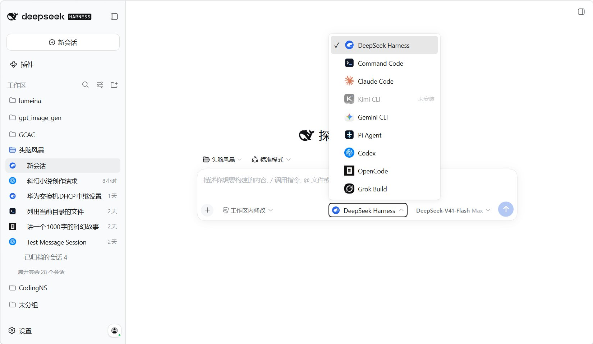
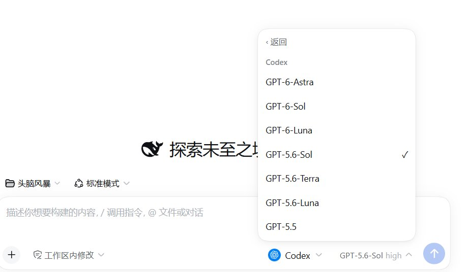
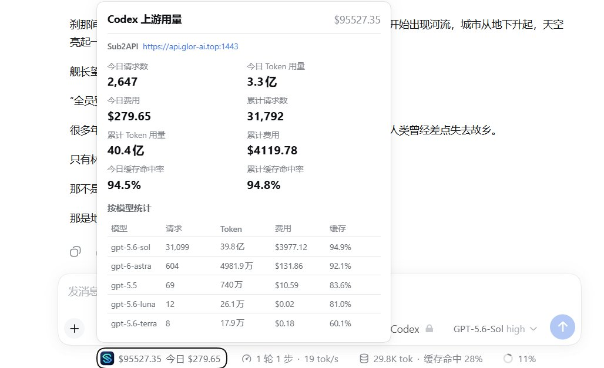
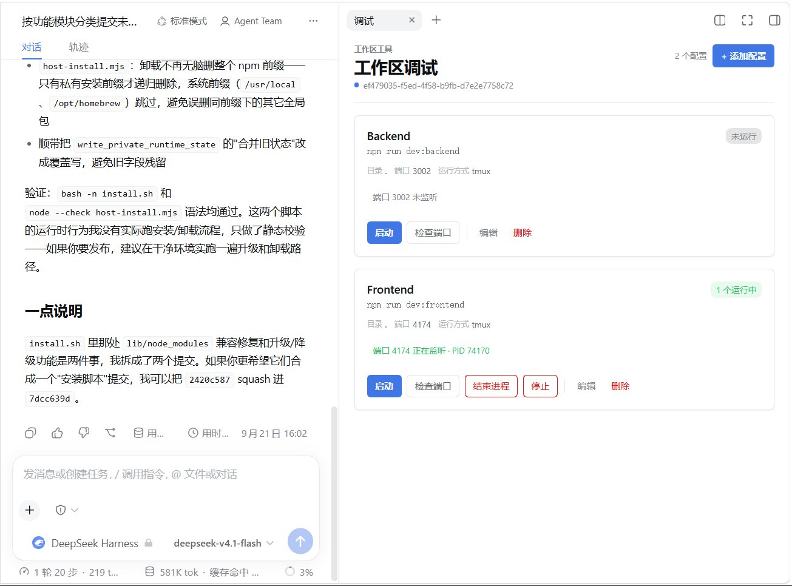
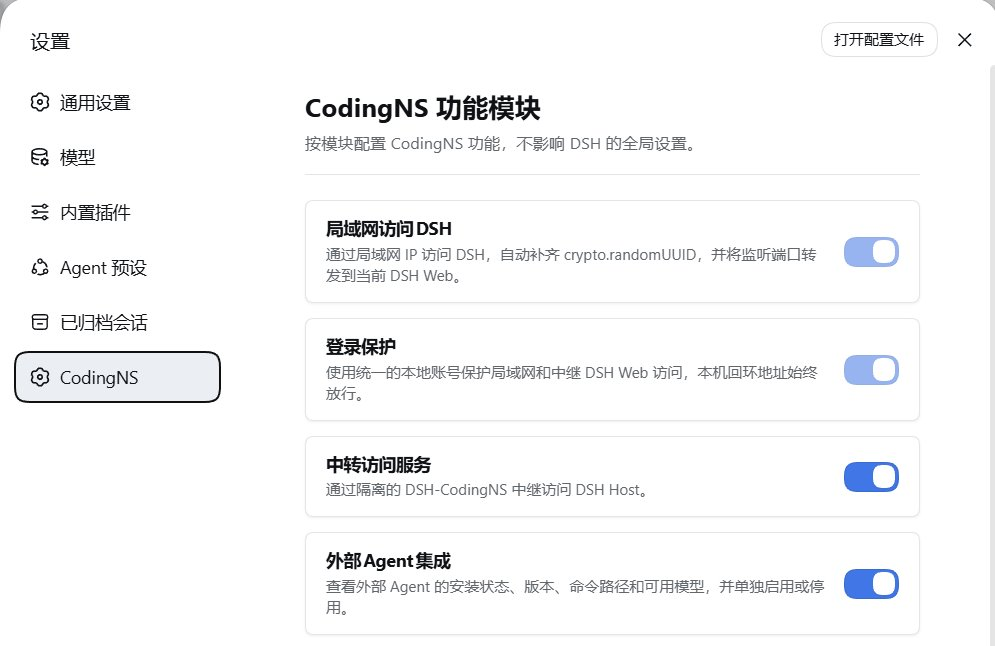
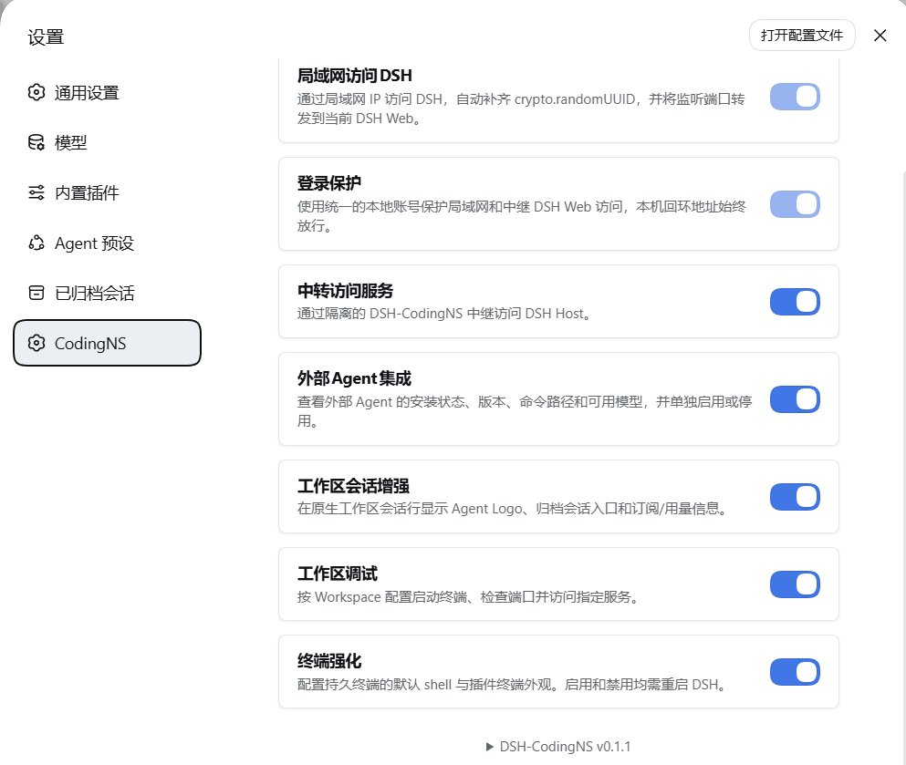
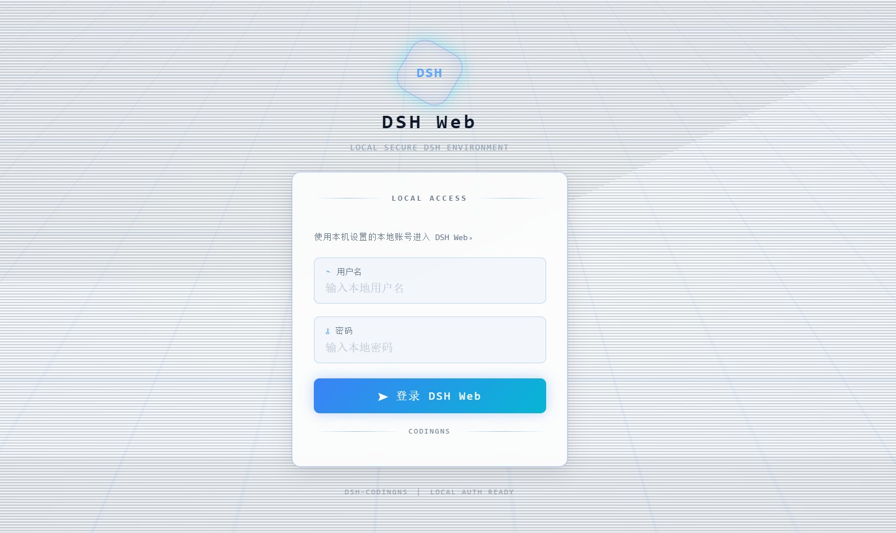
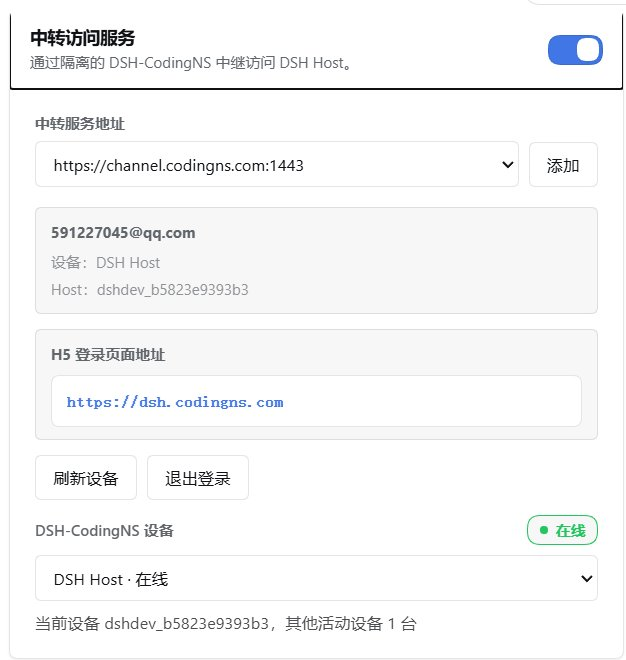
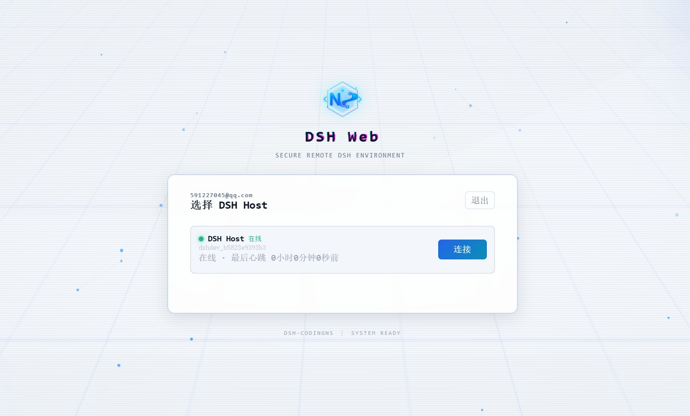
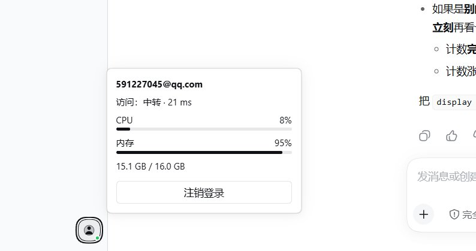

<div align="center">

# DSH-CodingNS for DeepSeek Harness

**把外部 Agent CLI、持久终端、工作区调试和远程访问，装进 DSH 原生界面。**<br>
**External Agent CLIs, persistent terminals, workspace debug and remote access — inside DSH's own UI.**

[](https://www.npmjs.com/package/dsh-codingns)
[](https://github.com/deepseek-ai/deepseek-harness)
[](https://nodejs.org)

**当前版本 `dsh-codingns@0.1.1`** · DSH **`>=0.1.5-rc.3 <0.1.8-0`**（已验证 `0.1.6-alpha.2`）· Node **`>= 22.19`** · macOS / Linux / Windows<br>
**Current release `dsh-codingns@0.1.1`** · DSH **`>=0.1.5-rc.3 <0.1.8-0`** (validated `0.1.6-alpha.2`) · Node **`>= 22.19`** · macOS / Linux / Windows

**[GitHub](https://github.com/jingyi0605/DSH-CodingNS)** · **[npm](https://www.npmjs.com/package/dsh-codingns)** · **QQ 群 / QQ group 1092985965**

<p>
  <a href="#界面预览-interface-preview">界面预览</a> ·
  <a href="#这是什么-what-is-dsh-codingns">这是什么</a> ·
  <a href="#支持的外部-agent-supported-agents">外部 Agent</a> ·
  <a href="#功能详解-feature-details">功能详解</a> ·
  <a href="#安装-installation">安装</a> ·
  <a href="#首次使用-first-run">首次使用</a> ·
  <a href="#故障排查-troubleshooting">故障排查</a> ·
  <a href="#开发-development">开发</a> ·
  <a href="#鸣谢-acknowledgements">鸣谢</a>
</p>

</div>

## 界面预览 Interface Preview

<div align="center">
  
</div>

输入框的 Agent 选择器：内置 DeepSeek Harness 与全部已安装的外部 Agent；左侧会话列表带 Agent Logo，并提供归档会话入口。<br>
The composer Agent picker — the built-in DeepSeek Harness plus every installed external Agent; the sidebar keeps per-Agent logos and an archived-session entry.

---

## 这是什么 What is DSH-CodingNS

**DSH（DeepSeek Harness）** 是 DeepSeek 的编码 Agent 运行框架，由 CLI 和 Web 界面组成，在你的 Workspace 中运行 Agent 循环。<br>
**DSH (DeepSeek Harness)** is DeepSeek's coding-agent harness — a CLI plus Web UI that runs an agent loop inside your workspace.

**DSH-CodingNS 是一个 DSH 插件 Bundle**（Host 层 + 浏览器层），提供七个模块，全部在 **设置 → CodingNS** 中配置。<br>
**DSH-CodingNS is a DSH plugin bundle** (Host + browser layers) adding seven modules, all configured under **Settings → CodingNS**.

> 名称说明：本插件名为 **DSH-CodingNS**（npm 包 `dsh-codingns`，设置页入口显示为 CodingNS）；文中单独出现的 **CodingNS** 指提供 Control API、账号与中继隧道的平台服务。<br>
> Naming: this plugin is **DSH-CodingNS** (npm package `dsh-codingns`; its settings entry is labelled CodingNS). **CodingNS** on its own refers to the platform service that provides the Control API, accounts and the relay tunnel.

| 模块 Module | 作用 What it does | 默认 Default |
| --- | --- | :---: |
| **外部Agent集成**<br>External Agent integration | 把已安装的 Agent CLI 变成 DSH 原生会话：流式输出、工具调用、权限确认、提问、用量、思考强度<br>Run installed Agent CLIs as native DSH sessions: streaming, tools, approvals, questions, usage, thinking levels | 开<br>On |
| **工作区会话增强**<br>Workspace session enhancement | 会话行显示 Agent Logo、归档会话入口、订阅/用量信息<br>Agent logos on session rows, archived-session entry, subscription/usage readout | 关<br>Off |
| **终端强化**<br>Terminal enhancement | 持久终端，以及 Shell、主题、字体、光标、滚动缓冲区设置<br>Persistent terminals plus shell, theme, font, cursor and scrollback settings | 关 · 需重启<br>Off · restart |
| **局域网访问DSH**<br>LAN access to DSH | 监听端口并把局域网地址转发到本机 DSH Web<br>Listener forwarding a LAN address to the local DSH Web port | 常驻<br>Always on |
| **登录保护**<br>Login protection | 可选：用统一的本地账号保护局域网**和**中继访问，回环地址始终放行<br>One optional local account guarding LAN **and** relay access; loopback always allowed | 常驻（卡片）<br>Always on (card) |
| **中转访问服务**<br>Relay access service | **在互联网任何位置访问自己的 DSH Web**，端到端加密<br>**Your DSH Web from anywhere on the internet**, end-to-end encrypted | 关<br>Off |
| **工作区调试**<br>Workspace debug | 按工作区保存启动配置、检查端口、HTTP 服务代理<br>Per-workspace launch profiles, port checks, HTTP service proxy | 开<br>On |

DSH 原生部分不会被替换：对话、会话列表、侧栏、设置、权限确认仍然是 DSH 自己的组件。<br>
Nothing native is replaced — conversations, sessions, sidebar, settings and approvals stay DSH's own.

一切都跑在 **Host（你的电脑）** 上：Agent 进程、终端、文件、局域网/中继监听；浏览器只是视图。Agent CLI 作为 DSH 子进程使用自己的凭据与上游，模型流量不经过插件。远程访问全部可用。<br>
Everything runs on the **Host** (your machine): Agents, terminals, files, LAN/relay listeners; the browser is only a view. Agent CLIs run as DSH child processes with their own credentials and providers — model traffic never goes through DSH-CodingNS. Remote paths are opt-in.

补充说明：DSH-CodingNS 装好后侧栏终端就已存在，**终端强化** 只是把它从基础本地 PTY 切换为持久后端（macOS/Linux 用 tmux，Windows 用 ConPTY），重启后生效；在 DSH `0.1.5.x` 上 DSH-CodingNS 运行于兼容模式（无多 Tab 与 Shell 选择），卡片会给出提示；**工作区调试** 目前界面文案只有中文。<br>
Notes: the sidebar terminal exists as soon as the plugin is installed — **Terminal enhancement** only switches it to the persistent backend (tmux on macOS/Linux, ConPTY on Windows) and applies on restart; on DSH `0.1.5.x` DSH-CodingNS runs in compatibility mode (no multi-tab or shell selection) and the cards say so; the 调试 card is currently Chinese-only.

---

## 支持的外部 Agent Supported Agents

在 Host 上按命令名检测，版本与模型列表从 CLI 自身读取；检测到的 Agent 默认启用，可单独启停。内置的 **DeepSeek Harness** Agent 始终可用。<br>
Detected on the Host by command name; version and models come from the CLI itself. Detected Agents are enabled by default and can be toggled individually. The built-in **DeepSeek Harness** Agent is always available.

| Agent | id | 命令 Command | 协议 Protocol | 能力 Capabilities |
| --- | --- | --- | --- | --- |
| Command Code | `command-code` | `command-code`、`commandcode`、`cmdc` | 单轮 CLI<br>single-shot CLI | 模型、流式、恢复、打断、工具、思考、用量<br>models, streaming, resume, interrupt, tools, thinking, usage |
| Claude Code | `claude-code` | `claude` | stream-json | 模型、流式、恢复、打断、工具、思考、用量<br>models, streaming, resume, interrupt, tools, thinking, usage |
| Kimi CLI | `kimi` | `kimi`、`kimi-cli` | stream-json | 上述全部 + 权限确认、提问、插话<br>all of the above + approvals, questions, steering |
| Gemini CLI | `gemini` | `gemini` | ACP | 模型、流式、恢复、打断、工具、思考、用量、权限确认<br>models, streaming, resume, interrupt, tools, thinking, usage, approvals |
| Pi Agent | `pi` | `pi`、`pi-agent` | JSON-RPC | 模型、流式、恢复、打断、工具、思考、用量、插话<br>models, streaming, resume, interrupt, tools, thinking, usage, steering |
| Codex | `codex` | `codex` | JSON-RPC（app-server）<br>JSON-RPC (app-server) | 全部 + 权限确认、提问、插话<br>all + approvals, questions, steering |
| OpenCode | `opencode` | `opencode`，或 `OPENCODE_SERVER_URL`（默认 `http://127.0.0.1:4096`）<br>`opencode`, or `OPENCODE_SERVER_URL` (default `http://127.0.0.1:4096`) | HTTP + SSE | 全部 + 权限确认、提问<br>all + approvals, questions |
| Grok Build | `grok` | `grok`、`grok-build` | ACP | 模型、流式、工具、思考、用量、权限确认<br>models, streaming, tools, thinking, usage, approvals |

**模型** 模型列表 · **流式** 实时输出 · **恢复** 重启后继续 · **打断** 取消当前回合 · **工具** 对话中渲染工具调用 · **思考** 推理/思考强度 · **用量** token 或订阅额度 · **权限确认 / 提问** 变成 DSH 原生交互 · **插话** 回合中追加消息。<br>
**models** model list · **streaming** live output · **resume** continue after restart · **interrupt** cancel a turn · **tools** tool calls in the conversation · **thinking** reasoning/effort · **usage** token or subscription limits · **approvals / questions** native DSH interactions · **steering** inject a message mid-turn.

未列出的能力表示该 CLI 或其版本不支持；Agent 的安装与登录都在 DSH 之外完成，DSH-CodingNS 不保存 Agent 凭据。<br>
Unlisted capabilities are unsupported by that CLI or version. Install and log in to each Agent outside DSH; DSH-CodingNS never stores Agent credentials.

---

## 功能详解 Feature Details

### 外部 Agent 集成 External Agent Integration

在选择器里挑选 Agent 与模型后，DSH-CodingNS 以 DSH 子进程方式启动（或恢复）该 CLI，并把事件流投影成原生会话；模型与思考强度按 Agent 记忆。<br>
After you pick an Agent and a model, DSH-CodingNS starts (or resumes) that CLI as a DSH child process and projects its event stream into a native session; the model and thinking effort are remembered per Agent.

<div align="center">
  
</div>

模型列表直接读取自各 CLI，可随时切换；按钮上还会显示当前模型与思考强度。<br>
The model list is read from each CLI and can be switched at any time; the composer button also shows the current model and thinking effort.

### 会话增强与订阅用量 Session Enhancement and Usage

会话行显示 Agent Logo 与归档入口，输入框下方显示可读取额度的 Agent 的订阅或上游用量（含缓存命中率、按模型统计与费用）。<br>
Session rows show the Agent logo and archive entry, and the composer dock shows subscription or upstream usage for Agents whose limits can be read (cache hit rate, per-model stats and cost included).

<div align="center">
  
</div>

用量来自 Agent 自身的额度接口或已配置的上游用量来源；数据只在 Host 上读取，不写入浏览器存储。<br>
Usage comes from the Agent's own quota API or a configured upstream source; it is read on the Host and never stored in the browser.

### 工作区调试 Workspace Debug

每个工作区一份启动配置（`<工作区>/.codingns/debug.json`）：命令、工作目录、环境变量、Shell 与可选端口，可一键启动、检查端口、结束进程或停止。可选反向代理会把端口通过 DSH 暴露出来，目前仅支持 HTTP。<br>
Each workspace keeps its own launch profiles (`<workspace>/.codingns/debug.json`): command, working directory, environment, shell and an optional port — start, check the port, kill the process or stop it. An optional reverse proxy exposes the port through DSH (HTTP only for now).

<div align="center">
  
</div>

面板实时显示端口监听状态与 PID，并按实例生成不可猜测的代理地址。<br>
The panel shows live port state and PID, and issues an unguessable proxy URL per running instance.

### 模块与设置 Modules and Settings

设置页按模块渲染卡片，开关、说明和「是否需要重启」都来自模块自身的描述；终端外观、局域网映射、登录保护、中转账号等都在对应卡片内配置。<br>
The settings page renders one card per module — switch, description and restart notice all come from the module itself; terminal appearance, LAN mapping, login protection and relay account are configured inside their own cards.

|  |  |
| --- | --- |
| 每个模块一张卡片，右侧是启停开关<br>One card per module with its own switch | 七个模块与底部版本信息<br>All seven modules plus the version footer |

### 登录保护 Login Protection

默认关闭，在卡片中开启后用统一的本地账号保护局域网**和**中继访问（默认会话超时 30 分钟）。认证发生在 Host 的转发边界，未登录请求不会到达 DSH Web；`127.0.0.1` 与 `::1` 永远放行，避免把自己锁在外面。<br>
Off by default; once enabled on its card, one local account guards LAN **and** relay access (default session timeout 30 minutes). Authentication happens at the Host's forwarding boundary, so unauthenticated traffic never reaches DSH Web; `127.0.0.1` and `::1` are always allowed to prevent lockout.

<div align="center">
  
</div>

密码以 `scrypt` 哈希保存在 `0600` 文件中，浏览器只持有 `HttpOnly`、`SameSite=Strict` 会话 Cookie。<br>
The password is `scrypt`-hashed in a `0600` file, and the browser only holds an `HttpOnly`, `SameSite=Strict` session cookie.

### 远程访问 Remote Access

| | 局域网访问 LAN access | 中转访问服务 Relay access |
| --- | --- | --- |
| 从哪里连接<br>Connect from | 同一局域网<br>Same local network | **任何设备、互联网上的任何位置<br>Any device, anywhere on the internet** |
| 前提<br>Needs | 同一网络 + 放行监听端口<br>Shared network + open listen port | Host 能通过 HTTPS 访问 Control API；设备能连上 CodingNS 入口<br>Host can reach the Control API over HTTPS; your device can reach the CodingNS entry |
| 是否暴露本地端口<br>Local port exposed | 是——所选网卡/端口（默认 `13080`）<br>Yes — chosen interface/port (default `13080`) | 否——独立设备隧道<br>No — isolated device tunnel |
| 账号<br>Account | 可选登录保护<br>Optional login protection | 需要 CodingNS 账号并绑定 Host<br>CodingNS account + bound Host |

**局域网**：选择监听网卡与端口，自动探测（或手动填写）本机 DSH Web 端口，启动后在另一台设备打开 `http://<局域网 IP>:<端口>`；开启自动启动可恢复映射，模块还会补齐明文 HTTP 来源所需的 `crypto.randomUUID`。<br>
**LAN**: pick a listen interface and port, auto-detect (or type) the local DSH Web port, start, then open `http://<lan-ip>:<port>` from another device; auto-start restores the mapping, and the module patches the `crypto.randomUUID` that plain-HTTP origins need.

**中转**：配置 Control API（默认 `https://channel.codingns.com:1443`，可在此注册账号），登录、刷新设备、绑定当前 Host（显示标签、公钥、指纹），之后在任意设备通过 **`https://dsh.codingns.com`** 打开已绑定的 Host——不需要公网 IP、端口映射或 VPN。<br>
**Relay**: set the Control API (default `https://channel.codingns.com:1443`, where you can register), log in, refresh devices, bind the current Host (label, public key, fingerprint), then open the bound Host from any device through **`https://dsh.codingns.com`** — no public IP, port forwarding or VPN.

|  |  |
| --- | --- |
| 中转卡片：服务地址、账号、设备列表与 H5 登录地址<br>Relay card: address, account, device list and the H5 login address | 在任意设备的 H5 页面选择已绑定的 Host 并连接<br>Pick the bound Host from any device and connect |

DSH 设置按钮旁的账户入口会显示登录状态、访问路径与延迟、Host CPU/内存，并可一键注销登录。<br>
The account entry next to DSH's Settings button shows login state, access path and latency, host CPU/memory, and offers one-click logout.

<div align="center">
  
</div>

其中「访问」会标明当前是通过本机、局域网还是中转进入 DSH Web。<br>
The “access” line tells you whether you entered DSH Web locally, over the LAN or through the relay.

**为什么中转看不到你的 DSH 内容**——隧道端到端加密，使用它不等于把对话交给服务器：<br>
**Why the relay cannot read your DSH traffic** — the tunnel is end-to-end encrypted, so using it never hands your conversations to a server:

- 载荷走在 **DSH Client 与 DSH Host 之间的 WebRTC DataChannel，由 DTLS 保护**；无论直连还是经 TURN，Relay 都只承载密文。<br>
  Payload travels in a **WebRTC DataChannel protected by DTLS between the DSH Client and the DSH Host**; direct or via TURN, only ciphertext crosses the relay.
- Relay 与控制站只处理**控制面元数据**：账号/设备记录、Host 绑定、ticket、SDP/ICE 信令、在线状态、流量统计。<br>
  The relay and control service handle **control-plane metadata only**: account/device records, Host binding, tickets, SDP/ICE signaling, online state, traffic accounting.
- 每个 Host 自持 DTLS 证书（`~/.config/dsh-codingns/dtls-identity.json`）并发布 SHA-256 指纹，远端在握手时核对；不一致直接中断（`Host DTLS fingerprint 校验失败`），不会接受被替换的证书；同一指纹显示在中转卡片中供人工比对。<br>
  Each Host keeps its own DTLS certificate (`~/.config/dsh-codingns/dtls-identity.json`) and publishes a SHA-256 fingerprint the remote side verifies during the handshake — a mismatch aborts the connection (`Host DTLS fingerprint 校验失败`) instead of accepting a substituted certificate; the same fingerprint shows in the relay card for manual comparison.
- 密码只用于登录请求；refresh token 与设备凭据留在 Host。诊断日志只记录协议元数据（方向、类型、流 ID、状态、字节数），不记录正文、票据、Cookie 或 DSH Web 内容。<br>
  Passwords are used only for login requests; refresh token and device credential stay on the Host. Diagnostics log protocol metadata only (direction, type, stream id, status, bytes) — never bodies, tickets, cookies or DSH Web content.

---

## 安装 Installation

**环境要求**：DSH 在 `>=0.1.5-rc.3 <0.1.8-0` 范围内（插件与 DSH 版本独立发布，安装期与运行期都会拒绝不兼容版本）· Node.js `>= 22.19` · `PATH` 中有 `pnpm`（`dsh plugin` 转发给 pnpm）· 可选：Agent CLI，以及 macOS/Linux 上用于持久终端的 `tmux`（`brew install tmux` / `sudo apt install tmux`）。<br>
**Requirements**: DSH inside `>=0.1.5-rc.3 <0.1.8-0` (plugin and DSH versions ship independently; both the installer and the runtime reject unsupported versions) · Node.js `>= 22.19` · `pnpm` on `PATH` (`dsh plugin` forwards to pnpm) · optional: Agent CLIs, and `tmux` on macOS/Linux for persistent terminals (`brew install tmux` / `sudo apt install tmux`).

DSH-CodingNS 需要 Profile 同时包含 DSH Web 应用层，因此先用官方 `web` 模板创建 Profile：<br>
DSH-CodingNS needs a profile that also contains the DSH Web application layer, so create the profile from the shipped `web` template first:

```bash
dsh codingns --from-default-profile web --dump-config   # 创建 Profile / create profile (prints layers, does not start)
dsh plugin --profile codingns add dsh-codingns@0.1.1    # 安装 Bundle / install the bundle
dsh codingns                                            # 启动 DSH / start DSH
```

也可直接装进标准 `web` Profile：`dsh plugin --profile web add dsh-codingns@0.1.1`，然后 `dsh web`。<br>
Or install into the standard web profile: `dsh plugin --profile web add dsh-codingns@0.1.1`, then `dsh web`.

- **不要**把 `dsh plugin --profile <新名字> add …` 当作新 Profile 的第一条命令：全新自定义 Profile 只含 `@deepseek-ai/dsh-base`，会报 `entry "terminal-controller" not found` 且没有浏览器界面。<br>
  **Do not** create a fresh profile with the plugin as its first command: a new custom profile only contains `@deepseek-ai/dsh-base`, so the patch reports `entry "terminal-controller" not found` and there is no browser UI.
- npm 返回 404 说明该版本还没发布，请改用下面的源码安装。<br>
  A registry 404 means that version is not published yet — use the source install below.

```bash
# 验证 / verify
dsh plugin --profile codingns list --depth 0     # -> dsh-codingns <版本 / version>
dsh --profile codingns --dump-config             # 应看到 id: dsh-codingns / expect id: dsh-codingns, terminal-controller disabled

# 升级、固定版本、卸载 / upgrade, pin, uninstall（之后重启 DSH / restart DSH afterwards）
dsh plugin --profile codingns add dsh-codingns@<版本 / version>
dsh plugin --profile codingns remove dsh-codingns
```

**从源码安装**（npm 不可用，或直接运行本地检出）：<br>
**From source** (npm unavailable, or running a checkout):

```bash
git clone https://github.com/jingyi0605/DSH-CodingNS.git && cd DSH-CodingNS
pnpm install && pnpm build
dsh codingns --from-default-profile web --dump-config
dsh plugin --profile codingns add "$PWD"            # 或 / or: npm pack, then add ./dsh-codingns-0.1.1.tgz
```

安装目录是链接依赖，改完源码后重新 `pnpm build`（或保持 `pnpm dev:watch`）并重启 DSH。<br>
A directory install links the checkout — rebuild (`pnpm build` / `pnpm dev:watch`) and restart DSH after changes.

**磁盘状态**：设置保存在 `$DSH_HOME/settings.yaml`（默认 `~/.dsh/settings.yaml`）的 `codingns:` 命名空间。<br>
**State on disk**: settings live in `$DSH_HOME/settings.yaml` (default `~/.dsh/settings.yaml`) under the `codingns:` namespace.

| 路径 Path | 内容 Contents |
| --- | --- |
| `$DSH_HOME/profiles/<profile>` | 已安装的插件包与 `dsh.profile.bundles`<br>Installed plugin packages and `dsh.profile.bundles` |
| `$DSH_HOME/dsh-codingns/` | 终端 `host-id` 与 `terminals.json`（恢复映射）<br>Terminal `host-id` and `terminals.json` (restore mapping) |
| `~/.config/dsh-codingns/` | 中转凭据、DTLS 身份、登录保护哈希<br>Relay credentials, DTLS identity, login-protection hash |
| `<工作区 workspace>/.codingns/debug.json` | 调试启动配置（`0600`，拒绝保存密钥）<br>Debug launch profiles (mode `0600`, secrets rejected) |

---

## 首次使用 First Run

1. `dsh codingns` 打开 DSH Web 界面。<br>
   `dsh codingns` opens the DSH Web UI.
2. 打开 **设置 → CodingNS** 查看模块卡片（需重启的模块会同时显示当前生效状态与下次启动目标）。<br>
   Open **Settings → CodingNS** to review the module cards (restart-required ones show both the effective and next-start state).
3. 在 DSH **之外** 安装并登录 Agent CLI，确保命令在 Host 的 `PATH` 中，然后在 **外部Agent集成** 中启用。<br>
   Install and log in to your Agent CLIs **outside** DSH, keep them on the Host `PATH`, then enable them in **外部Agent集成**.
4. 在输入框选择 Agent、模型和思考强度并发送消息——输出流式写入原生会话，并带 Agent Logo 出现在侧栏。<br>
   Pick an Agent, model and thinking level in the composer and send a prompt — output streams into a native session with the Agent's logo.
5. 右侧栏：终端面板为当前工作区开终端（要持久化请启用 **终端强化** 后重启）；**调试** 面板添加启动配置并查看端口。<br>
   Right sidebar: Terminal for a workspace shell (enable **终端强化** + restart for persistence); 调试 to add a launch profile and watch its port.
6. 需要远程使用时，开启 **登录保护**、配置 **局域网访问DSH**，或登录 **中转访问服务** 从任意网络访问；账户入口会显示当前访问路径与 Host 负载。<br>
   For remote use, turn on **登录保护**, configure **局域网访问DSH**, or log in to **中转访问服务** to connect from any network; the account entry shows the current path and host load.

---

## 故障排查 Troubleshooting

- **版本 Versions** —— `dsh --version`、`dsh plugin --profile codingns list --depth 0`、`npm view dsh-codingns version`；安装与启动都会拒绝范围外的 DSH。<br>
  `dsh --version`, `dsh plugin --profile codingns list --depth 0`, `npm view dsh-codingns version`; install and startup both reject DSH outside the supported range.
- **`patch: entry "terminal-controller" not found`** —— Profile 缺少 Web 应用层，按上文用 `web` 模板重建。<br>
  The profile lacks the Web app layer; recreate it from the `web` template as shown above.
- **检测不到 Agent Agent not detected** —— 在 Host 上执行 `<cli> --version`；确认其目录在启动 DSH 的进程的 `PATH` 中（图形启动器常不同）；用各家工具登录后重启 DSH。<br>
  Run `<cli> --version` on the Host; ensure its directory is on the `PATH` of the process that started DSH (GUI launchers often differ); log in with the vendor tool, then restart DSH.
- **终端 Terminal** —— macOS/Linux 持久模式需要 `tmux`；启停模块与修改绑定范围需重启；终端按工作区寻址。<br>
  Persistent mode needs `tmux` on macOS/Linux; enabling/disabling the module and changing the binding scope need a restart; terminals are addressed per workspace.
- **局域网 LAN** —— 确认卡片转发信息、防火墙放行、两台设备同网络；多个 DSH 实例时手动选择探测到的端口；开启登录保护后需先登录。<br>
  Check the card's forwarding line, allow the port through the firewall, keep both devices on one network; with several DSH instances pick the detected port manually; sign in first when login protection is on.
- **中转 Relay** —— 检查 Control API 可达性，会话过期则重新登录，刷新设备后绑定 Host。<br>
  Verify Control API reachability, log in again if the session expired, refresh devices, then bind the Host.
- **日志 Logs** —— `DSH_CODINGNS_TUNNEL_DEBUG=1 dsh codingns --no-open`（仅元数据 / metadata only）；pnpm 安装日志在 `$DSH_HOME/profiles/<profile>/.plugin-manager/logs/`。<br>
  `DSH_CODINGNS_TUNNEL_DEBUG=1 dsh codingns --no-open` (metadata only); pnpm install logs live in `$DSH_HOME/profiles/<profile>/.plugin-manager/logs/`.
- **反馈 Reporting** —— 附上 DSH 与 DSH-CodingNS 版本、操作系统、涉及模块和完整错误：[GitHub Issues](https://github.com/jingyi0605/DSH-CodingNS/issues) 或 QQ **1092985965**。<br>
  Include DSH and DSH-CodingNS versions, OS, module and exact error: [GitHub Issues](https://github.com/jingyi0605/DSH-CodingNS/issues) or QQ **1092985965**.

---

## 开发 Development

需要 Node `>= 22.19` 与 pnpm：<br>
Requires Node `>= 22.19` and pnpm:

```bash
pnpm install
pnpm build            # 版本校验 → tsc → Client + H5 Bundle / version check -> tsc -> client + H5 bundles
pnpm test             # 构建后运行 61 个测试套件 / build, then 61 suites under tests/
pnpm typecheck
pnpm run capability:check   # DSH 能力注册表退休检查 / capability retirement check
```

开发循环：`pnpm dev:watch` 配合 `pnpm dev:link <profile>`，然后重启 DSH。版本源是 `version.json`（`version:set-plugin` / `version:set-dsh`，由 `version:check` 守卫）。<br>
Dev loop: `pnpm dev:watch` with `pnpm dev:link <profile>`, then restart DSH. Versions come from `version.json` (`version:set-plugin` / `version:set-dsh`, guarded by `version:check`).

目录：`src/host`（Host 层）、`src/client`（浏览器层）、`src/dsh-capabilities`（DSH 能力注册与版本路由）、`src/shared/contracts`、`src/transport`（隧道与 WebRTC）、`src/features`（模块注册表）、`tests/`、`specs/`、`docs/`、`data/build`（已忽略）。<br>
Layout: `src/host` (Host layer), `src/client` (browser layer), `src/dsh-capabilities` (capability registry and version routing), `src/shared/contracts`, `src/transport` (tunnel + WebRTC), `src/features` (module registry), `tests/`, `specs/`, `docs/`, `data/build` (git-ignored).

推送 `v*` tag 触发 GitHub Actions（tag/版本校验、冻结安装、类型检查、测试、`npm pack`）并以 provenance 发布，预发布版本用 `next` dist-tag。路线图：PeerHost、文件管理、工作区会话、调试代理完善（鉴权 + WebSocket）、Git、SKILL、更多。<br>
A `v*` tag runs GitHub Actions (tag/version check, frozen install, typecheck, tests, `npm pack`) and publishes with provenance; prereleases get the `next` dist-tag. Roadmap: PeerHost, file management, workspace sessions, debug-proxy completion (auth + WebSocket), Git, SKILL, more.

截图素材与清单见 [assets/screenshots](assets/screenshots/README.md)。<br>
Screenshot assets and shot list: [assets/screenshots](assets/screenshots/README.md).

---

## 鸣谢 Acknowledgements

DSH-CodingNS 的项目灵感与部分实现思路来自 **[CodexHost](https://github.com/BytePioneer-AI/codex-host)**——它把 Pi、Claude Code、Grok Build 等 Harness 原生跑在 Codex Desktop 里，展示了 DSH-CodingNS 从另一侧沿用的方向：**把其他 Harness 作为一等 Agent 接入**，而不是替换它们。多 Harness 适配器模型、把 CLI 事件流投影为宿主原生会话、让每个 Agent 的会话留在宿主侧栏与输入框，都源自该项目的设计。感谢其作者与社区。<br>
The inspiration for DSH-CodingNS — and part of its implementation approach — comes from **[CodexHost](https://github.com/BytePioneer-AI/codex-host)**, which runs Pi, Claude Code, Grok Build and other Harnesses natively inside Codex Desktop. It showed the direction DSH-CodingNS follows from the other side: host *other* Harnesses as first-class Agents instead of replacing them. The multi-Harness adapter model, projecting a CLI event stream into native sessions, and keeping each Agent's sessions in the host sidebar and composer trace back to that design. Thanks to its authors and community.

DSH-CodingNS 是独立项目，与 CodexHost 无隶属关系。<br>
DSH-CodingNS is an independent project and is not affiliated with CodexHost.
