<div align="center">

# CodingNS for DeepSeek Harness

**在 DSH 中使用多种编程 Agent、管理项目、与智能助理交流，并随时远程访问工作台。**

[](https://www.npmjs.com/package/@jingyi0605/codingns4dsh)
[](https://github.com/deepseek-ai/deepseek-harness)
[](https://nodejs.org)
[](https://www.gnu.org/licenses/gpl-3.0.html)

**简体中文** · [English](README.en.md)

**当前版本 `@jingyi0605/codingns4dsh@0.2.1-beta.7`** · DSH **`>=0.2.0-rc.2 <=0.2.1-alpha.1`**（已验证 `0.2.1-alpha.1`）· Node **`>= 22.19`** · macOS / Linux / Windows

**[GitHub](https://github.com/jingyi0605/Codingns4DSH)** · **[npm](https://www.npmjs.com/package/@jingyi0605/codingns4dsh)** · **QQ 群 1092985965** · **[微信群 / QQ 群二维码](#交流群)**

<p>
  <a href="#界面预览">界面预览</a> ·
  <a href="#这是什么">这是什么</a> ·
  <a href="#支持的外部-agent">外部 Agent</a> ·
  <a href="#功能介绍">功能介绍</a> ·
  <a href="#安装">安装</a> ·
  <a href="#首次使用">首次使用</a> ·
  <a href="#故障排查">故障排查</a> ·
  <a href="#交流群">交流群</a> ·
  <a href="#开发">开发</a> ·
  <a href="#鸣谢">鸣谢</a> ·
  <a href="#许可证">许可证</a>
</p>

</div>

## 界面预览

<div align="center">
  
</div>

CodingNS 工作台把会话、Agent 选择器与右侧 Git 面板放在同一界面中。

---

## 这是什么

**Codingns4DSH** 是 [DSH（DeepSeek Harness）](https://github.com/deepseek-ai/deepseek-harness) 的扩展插件，把多种编程 Agent、项目工具和智能助理整合到同一个工作台。所有模块都可以在 **设置 → Codingns4DSH** 中管理。

| 模块 | 能做到什么 | 默认 |
| --- | --- | :---: |
| **外部 Agent 集成** | 在 DSH 内使用多种编程 Agent，切换模型并查看执行过程 | 开 |
| **工作区会话增强** | 识别会话所属 Agent，管理归档会话，优化自动标题，查看订阅与用量 | 关 |
| **移动端访问增强** | 手机布局、侧栏手势、添加到主屏幕与通知 | 开 |
| **终端强化** | 使用持久终端，自定义终端外观 | 关 |
| **局域网访问 DSH** | 让同一网络的其他设备访问工作台 | 入口常驻 |
| **登录保护** | 为局域网和中转访问设置登录验证 | 关 |
| **中转访问服务** | 从互联网访问自己的 DSH，连接端到端加密 | 关 |
| **工作区调试** | 保存项目启动配置，管理进程、检查端口和访问服务 | 开 |
| **Git 仓库管理** | 查看改动、暂存、提交、切换分支与浏览历史 | 开 |
| **文件管理增强** | 创建、编辑、重命名、移动、复制和删除文件 | 关 |
| **PeerHost 聚合工作台** | 在当前工作台使用其他 DSH Host 的工作区与会话 | 关 |
| **全局智能助理（测试中）** | 文字与语音交流、了解项目进展、跟进任务、自定义形象 | 关 |

Agent、终端和项目文件在运行 DSH 的电脑（Host）上处理；浏览器提供统一操作界面，远程访问按需开启。

---

## 支持的外部 Agent

安装并登录对应 Agent 后，Codingns4DSH 会自动检测并接入；内置 **DeepSeek Harness** Agent 仍可使用。你可以在同一界面选择模型、查看流式回复，并使用各 Agent 提供的会话续接、工具调用和思考强度设置。

在 **设置 → Codingns4DSH → 外部 Agent 集成 → 代理列表** 中，可以切换本机 Host 和已登记的 PeerHost，查看安装状态、版本、命令路径与模型详情，并重新检测单个或全部 Agent。远端查询需要开启 PeerHost 模块并连接局域网 Host；远端启用状态只读，启用设置在所属 Host 管理。

下表列出部分主要能力，具体支持取决于 Agent 及其版本。Skill 指可复用的技能，插话指在执行过程中追加消息。

| Agent | 主要能力 | 备注 |
| --- | --- | --- |
| **Command Code** | Skill、权限确认、提问、用量 | 沿用 DSH 权限设置，支持原生问题面板 |
| **Claude Code** | Skill、权限确认、提问、用量 | 支持原生技能目录与技能调用 |
| **Kimi CLI** | 权限确认、提问、插话、用量 | — |
| **Gemini CLI** | 权限确认、提问、用量 | 支持原生权限确认与表单提问 |
| **Pi Agent** | 插话、思考强度、用量 | 当前协议的 DSH 权限与提问回传尚未验证 |
| **Codex** | 权限确认、提问、插话、用量 | 提问由 DSH 原生问题面板承载 |
| **OpenCode** | Skill、权限确认、提问、用量 | 支持本地 CLI 或已有服务，以及原生技能调用 |
| **Grok Build** | Skill、权限确认、提问、用量 | 支持原生技能目录与结构化提问 |
| **MiniMax Code** | 权限确认、提问、用量 | 默认接入支持交互；显式思考档位的执行模式不支持交互回传。<br>上游贡献者：[chenjunyi000](https://github.com/chenjunyi000)<br>提交 PR [#6](https://github.com/jingyi0605/Codingns4DSH/pull/6)、[#7](https://github.com/jingyi0605/Codingns4DSH/pull/7) |
| **ZCode** | 模型选择、会话续接、用量 | 支持 CLI 或桌面应用内置运行时。<br>上游贡献者：[chenjunyi000](https://github.com/chenjunyi000)<br>提交 PR [#6](https://github.com/jingyi0605/Codingns4DSH/pull/6)、[#7](https://github.com/jingyi0605/Codingns4DSH/pull/7) |
| **CodeBuddy** | 权限确认、提问、用量 | 自动识别国内／国际版。<br>CodexHost 上游贡献者：[mouzhi](https://github.com/mouzhi)<br>首次适配 [f30b000](https://github.com/BytePioneer-AI/codex-host/commit/f30b000f88950c40844b071eec2f6f385c6bcb49) |
| **WorkBuddy** | 权限确认、提问、思考强度 | 使用 WorkBuddy 桌面应用内置运行时。<br>CodexHost 上游贡献者：[BytePioneer-AI（ChongWen）](https://github.com/BytePioneer-AI)<br>首次适配 [6e9f365](https://github.com/BytePioneer-AI/codex-host/commit/6e9f365e2bf8ac61716f8250475530ae790f2d2f) |
| **Cursor CLI** | 权限确认、提问、思考强度 | CodexHost 上游贡献者：[mouzhi](https://github.com/mouzhi)<br>首次适配 [ad6ba8e](https://github.com/BytePioneer-AI/codex-host/commit/ad6ba8e04d294c473d2dcad99880496ff39c1f7e) |
| **Kiro CLI** | 权限确认、提问、思考强度 | CodexHost 上游贡献者：[gy212](https://github.com/gy212)<br>首次适配 [79675cd](https://github.com/BytePioneer-AI/codex-host/commit/79675cdbfdc042eb37a849c3eb1539e9efc40a0d) |
| **Qoder** | 权限确认、提问、思考强度 | CodexHost 上游贡献者：[gy212](https://github.com/gy212)、[BytePioneer-AI（ChongWen）](https://github.com/BytePioneer-AI)<br>PR #289 合并 [8926130](https://github.com/BytePioneer-AI/codex-host/commit/8926130af1426a467747b66d8d2dbf68f7764a7b) |
| **Qoder CN** | 权限确认、提问、思考强度 | CodexHost 上游贡献者：[gy212](https://github.com/gy212)、[BytePioneer-AI（ChongWen）](https://github.com/BytePioneer-AI)<br>PR #289 合并 [8926130](https://github.com/BytePioneer-AI/codex-host/commit/8926130af1426a467747b66d8d2dbf68f7764a7b) |
| **Antigravity** | 会话续接、工具调用、思考强度 | 权限设置映射为安全模式，不提供交互式审批或提问。<br>CodexHost 上游贡献者：[gy212](https://github.com/gy212)<br>首次适配 [ed4e785](https://github.com/BytePioneer-AI/codex-host/commit/ed4e785116642eafc08e4186e92e83f3816c7765) |

Agent 的安装与登录由各自工具完成。适配细节见[外部 Agent 文档](specs/spec007.1-外部Agent适配器扩展/README.md)。

---

## 功能介绍

### 外部 Agent 集成

选择 Agent 和模型即可开始编程，回复、工具调用、权限确认与提问直接显示在 DSH 对话中。模型与思考强度按 Agent 记忆，也可将任务委派给其他已接入的 Agent。

<div align="center">
  <table>
    <tr>
      <td>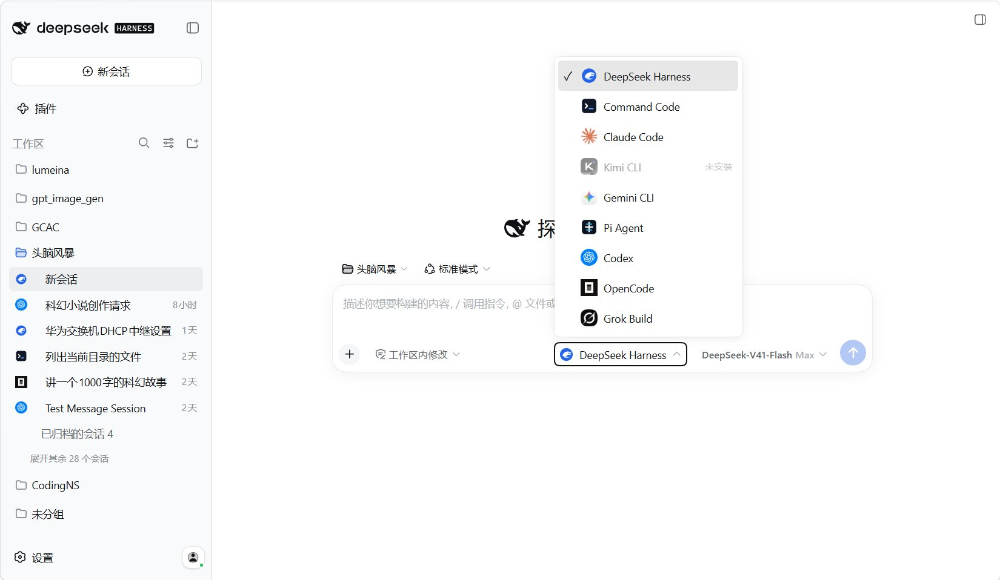</td>
      <td>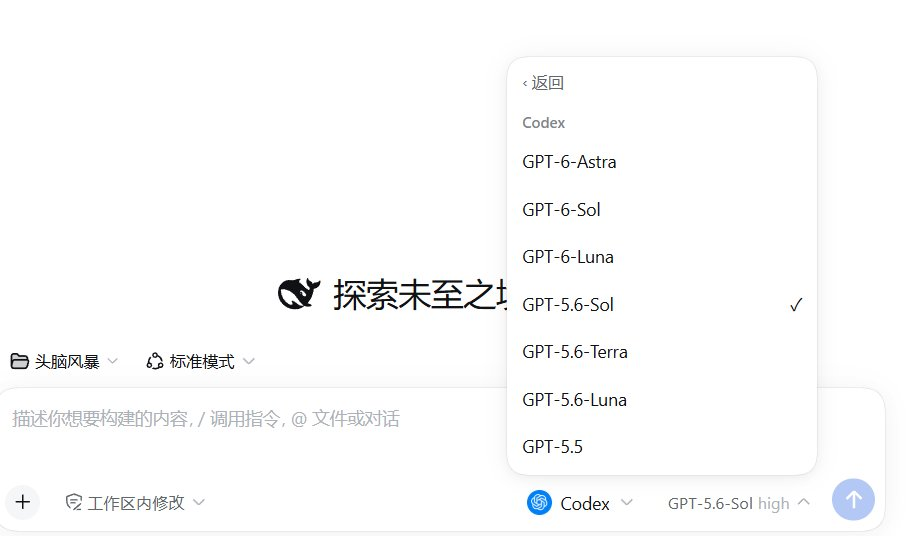</td>
    </tr>
  </table>
</div>

### 会话增强与订阅用量

通过 Agent 图标快速识别会话，访问归档记录，隐藏或恢复工作区。支持的 Agent 可查看订阅额度、重置时间、用量和费用，便于掌握使用情况。

<div align="center">
  <table>
    <tr>
      <td>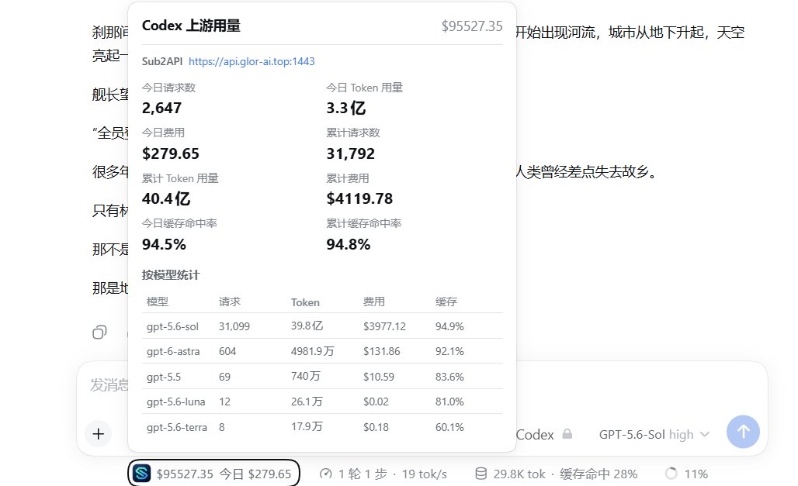</td>
      <td></td>
    </tr>
  </table>
</div>

### 全局智能助理（测试中）

创建自己的助理，自定义名称、性格、模型与形象，从侧栏或悬浮形象进入同一工作台。

- **连续交流**：文字和实时语音共用历史，切换输入方式后可继续追问。
- **项目跟进**：了解所选项目的进展，查询会话内容，并按你的要求发送跟进消息。
- **联网查询**：通过已配置的 DSH 搜索服务查询天气、新闻等实时信息。
- **附件交流**：发送图片和文本文件，结合材料提问；图片理解需要视觉模型。
- **形象与声音**：使用内置或第三方形象，自定义头像和音色；通话支持字幕、静音与收起悬浮。

默认使用浏览器语音播报，可选本地 MOSS 语音。助理负责交流与管理，不直接执行命令或修改代码。

### 终端与日志分享

安装插件后即可使用侧栏终端；启用 **终端强化** 并重启 DSH 后，可使用持久终端。终端按工作区共享，切换会话时保留终端状态。

可以把终端输出或选中的日志加入新会话或已有会话，直接请 Agent 分析问题。

### 工作区调试

为每个项目保存启动配置，一键启动或停止进程、查看端口状态，并通过 DSH 访问项目的 HTTP 服务。调试面板目前仅提供中文界面。

<div align="center">
  <table>
    <tr>
      <td>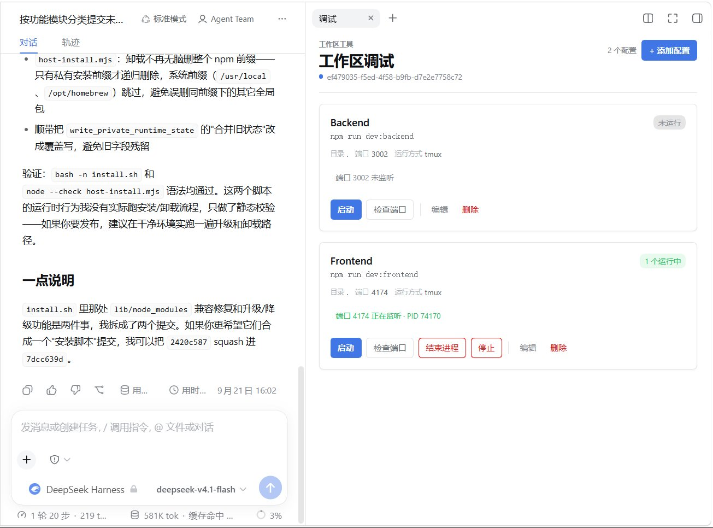</td>
      <td></td>
    </tr>
  </table>
</div>

### Git 仓库管理

在右侧栏完成仓库初始化、查看改动、暂存与取消暂存、提交、切换分支和浏览历史，无需离开当前会话。

### 文件管理增强

在文件侧栏创建、编辑、重命名、移动、复制或删除文件与目录，直接处理项目文件。

### PeerHost 多 Host 工作区

将局域网中的其他 DSH Host 加入当前工作台，统一访问远端工作区、会话、文件、Git 和终端。各 Host 保持独立，单个远端断开不会影响本地工作。当前不支持通过中转服务聚合 PeerHost。

已添加的远端工作区与会话列表会缓存在本机。断线后工作区置灰，仍可展开缓存列表；点击灰色行末的 `×` 可临时移除记录，重连后按添加状态恢复。断线期间每 5 秒复检，成功重连后恢复正常配色和最新列表。缓存不包含会话正文。实现与验证见 [PeerHost 断线工作区缓存与恢复记录](docs/开发记录/20261009-PeerHost断线工作区缓存与恢复记录.md)。

远端 Windows 会话中的文件链接支持 `/C:/.../文件.md:行号` 写法，打开时会转换文件路径并跳转对应行。实现与验证见 [PeerHost 消息文件链接路径修复记录](docs/开发记录/20261009-PeerHost消息文件链接路径修复记录.md)。

远端会话的消息反馈读取、保存、删除以及会话级反馈均由所属 Host 处理；聚合端与目标端需要加载包含修复的插件代码。实现与验证见 [PeerHost 会话反馈状态路由修复记录](docs/开发记录/20261009-PeerHost会话反馈状态路由修复记录.md)。

### 移动端访问

在手机上查看会话、发送消息和使用工作区工具，通过横滑手势开合侧栏。支持添加到主屏幕，并在受支持的浏览器中使用通知。

### 模块与设置

按需启用功能，在对应模块卡片中完成配置；需要重启的设置会明确提示。

启用开关统一靠右，相关设置图标位于开关左侧；子设置开关更小、更轻，明暗主题和窄屏布局沿用 DSH 风格。实现与验证见 [插件设置开关统一记录](docs/开发记录/20261009-插件设置开关右对齐与样式统一记录.md)。

「工作区会话增强」新增「优化DSH会话标题生成逻辑」，默认关闭。开启后，新自动标题优先概括完整主题，中文通常为 12～24 字，保留必要的技术名称和版本号。规则、模型失败时的兜底处理与测试见 [DSH 会话标题优化实现记录](docs/开发记录/20261009-DSH会话标题优化设置与生成逻辑实现记录.md)。

<div align="center">
  <table>
    <tr>
      <td>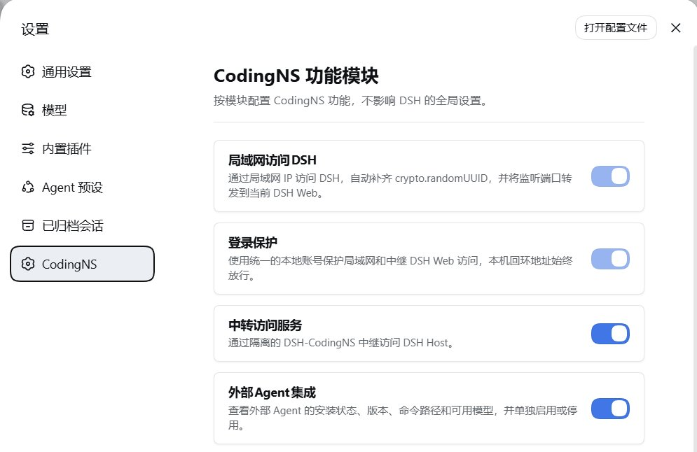</td>
      <td>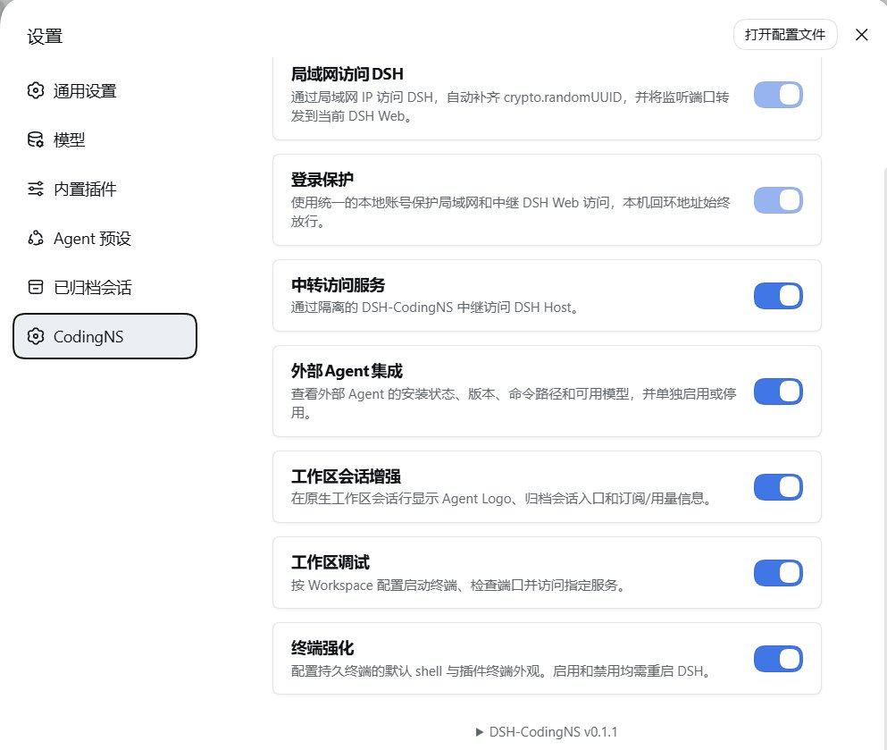</td>
    </tr>
  </table>
</div>

### 登录保护

可为局域网和中转访问设置统一的本地账号，保护远程工作台；本机访问不受影响。

<div align="center">
  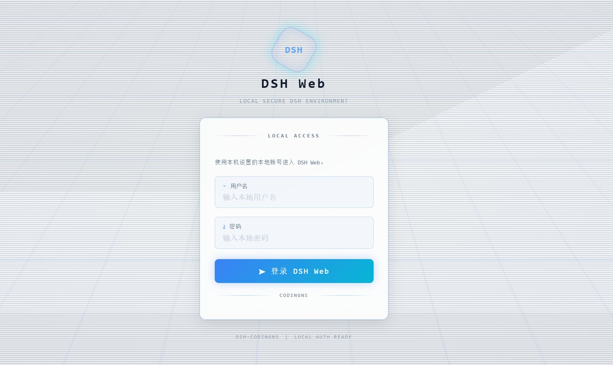
</div>

### 远程访问

| 方式 | 适用场景 | 使用方式 |
| --- | --- | --- |
| **局域网访问** | 同一网络的电脑、手机或平板 | 开启映射，复制访问地址 |
| **中转访问** | 外出时访问自己的工作台 | 登录中转账号，绑定 Host 后访问 |

中转服务无需公网 IP、端口映射或 VPN。可在 [Codingns4DSH 中转平台](https://channel.codingns.com:1443) 注册，并通过 [远程工作台](https://dsh.codingns.com) 连接已绑定的 Host。连接端到端加密，中转服务无法读取对话内容。

<div align="center">
  <table>
    <tr>
      <td>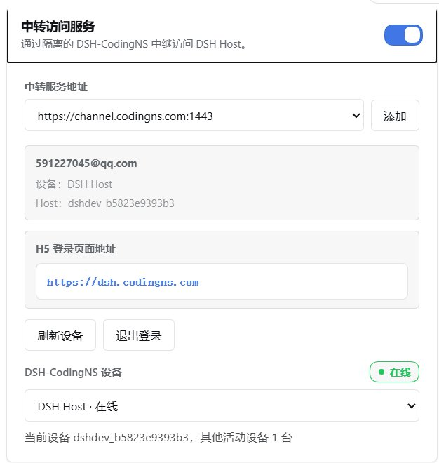</td>
      <td>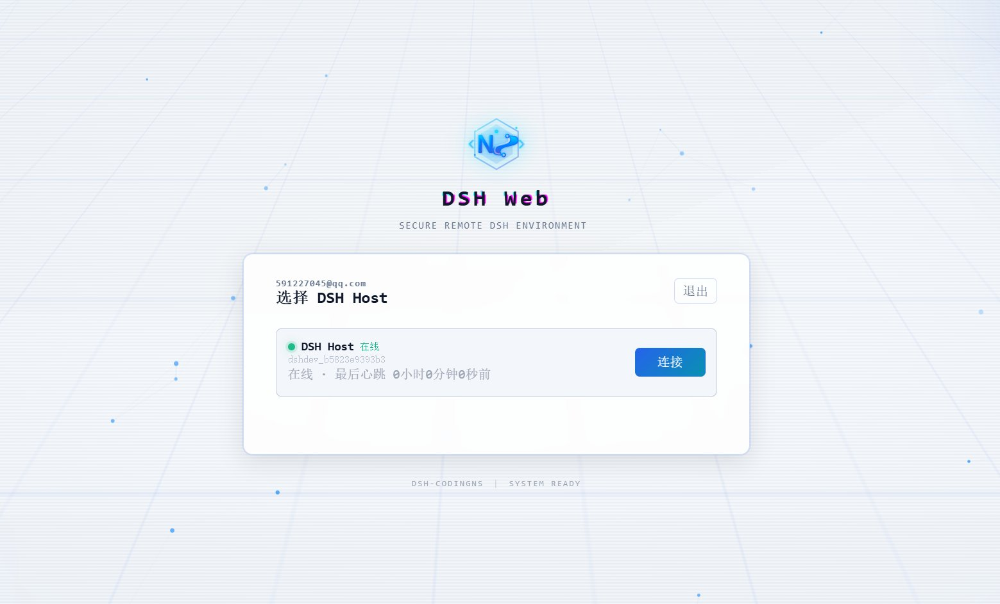</td>
    </tr>
  </table>
</div>

<div align="center">
  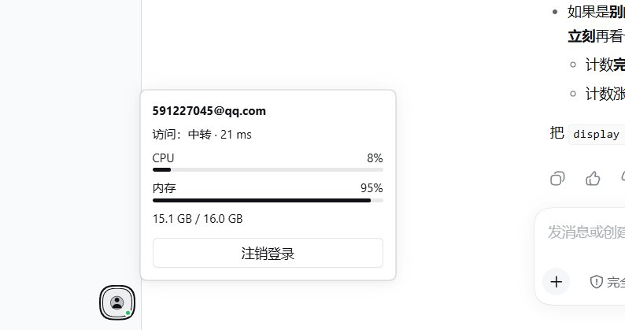
</div>

账户入口可查看登录状态、当前访问方式、连接延迟和 Host 负载。

---

## 安装

**环境要求**：DSH `>=0.2.0-rc.2 <=0.2.1-alpha.1`（已验证 `0.2.1-alpha.1`）、Node.js `>=22.19`，并安装 pnpm。macOS/Linux 的持久终端还需要 tmux。

### 使用内置 Web 配置

```bash
dsh plugin --profile web add @jingyi0605/codingns4dsh@0.2.1-beta.7
dsh web
```

### 可选：使用独立配置

需要独立环境时，从内置 Web 配置创建 Profile（运行配置）：

```bash
dsh codingns --from-default-profile web --dump-config
dsh plugin --profile codingns add @jingyi0605/codingns4dsh@0.2.1-beta.7
dsh codingns
```

已有 DSH 实例安装或升级插件后需重启。升级时将安装命令中的版本号替换为目标版本；卸载使用 `dsh plugin --profile web remove @jingyi0605/codingns4dsh`，独立配置请将 `web` 替换为配置名。

---

## 首次使用

1. 打开 **设置 → Codingns4DSH**，启用需要的模块。
2. 在运行 DSH 的电脑上安装并登录 Agent，在输入框选择 Agent 与模型开始对话。
3. 通过右侧栏使用终端、Git、文件与调试工具。
4. 启用全局智能助理，创建角色后开始交流；实时语音可在声音管理中准备资源。
5. 需要跨设备使用时，配置局域网或中转访问，并按需启用登录保护。

---

## 故障排查

- **安装失败**：确认 DSH、Node.js 和插件版本符合要求；独立配置需从 Web 模板创建。
- **检测不到 Agent**：确认 Agent 已安装、已登录，且启动 DSH 的环境能够找到它的命令。
- **终端未持久化**：启用终端强化后重启 DSH；macOS/Linux 需安装 tmux。
- **语音不可用**：在声音管理中检查资源状态，并允许浏览器使用麦克风。
- **远程连接失败**：局域网访问检查网络和防火墙；中转访问检查登录状态及 Host 绑定。

反馈问题时，请附上 DSH 与插件版本、操作系统和完整错误：[GitHub Issues](https://github.com/jingyi0605/Codingns4DSH/issues) 或 [交流群](#交流群)。

---

## 交流群

微信群与 QQ 群用于提问、反馈和版本更新通知，扫码即可加入。

<div align="center">
  <table>
    <tr>
      <td align="center" width="50%">
        <br>
        <b>微信群</b>：DSH-插件交流群
      </td>
      <td align="center" width="50%">
        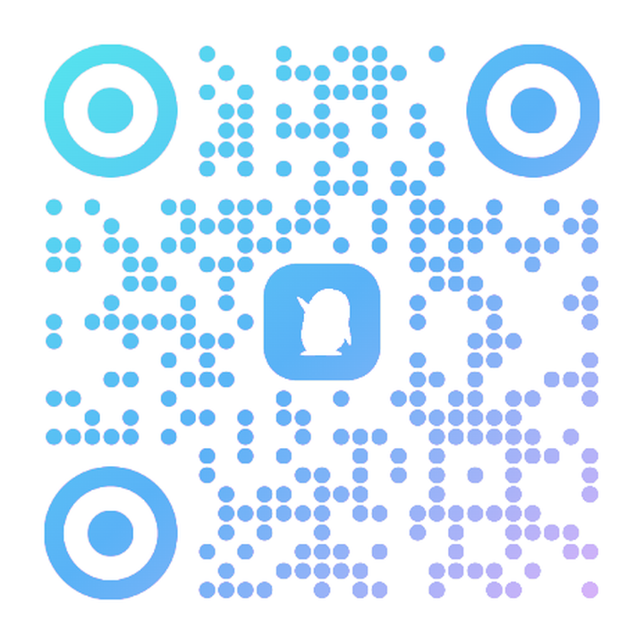<br>
        <b>QQ 群</b>：1092985965
      </td>
    </tr>
  </table>
</div>

微信群二维码由微信动态生成，**7 天内有效**（本图截取自 2026-10-08，标注「10 月 15 日前」有效），过期后重新进入群分享页会得到新码，也可在 [GitHub Issues](https://github.com/jingyi0605/Codingns4DSH/issues) 留言索取；QQ 群二维码与群号长期有效。

---

## 开发

源码开发使用独立 Stage0 环境，遵循[项目开发规则](AGENTS.md)。构建、测试与类型检查命令：

```bash
pnpm install
pnpm build
pnpm test
pnpm typecheck
```

源码链接与调试仅用于 Stage0；Desktop 使用已发布版本，不安装源码链接或本地开发包。开发环境说明见 [Stage0 开发记录](docs/开发记录/20261007-Stage0自动编译与热重载接入记录.md)。

功能设计与实现细节见 [Spec 文档](specs/)、[开发记录](docs/开发记录/)和[开发规范](docs/开发规范/)。[形象包目录](assets/assistant-avatar-catalog.md)与[截图清单](assets/screenshots/README.md)也可单独查阅。

---

## 鸣谢

感谢 **[CodexHost](https://github.com/BytePioneer-AI/codex-host)** 的作者与社区，为多 Agent 集成提供灵感与实现参考。Codingns4DSH 是独立项目，与 CodexHost 无隶属关系。

感谢适配器贡献者及上游贡献者：

- [chenjunyi000](https://github.com/chenjunyi000)：MiniMax Code、ZCode（[#6](https://github.com/jingyi0605/Codingns4DSH/pull/6)、[#7](https://github.com/jingyi0605/Codingns4DSH/pull/7)）。
- [mouzhi](https://github.com/mouzhi)：CodeBuddy、Cursor CLI。
- [BytePioneer-AI（ChongWen）](https://github.com/BytePioneer-AI)：WorkBuddy、Qoder。
- [gy212](https://github.com/gy212)：Kiro CLI、Qoder、Antigravity。

---

## 许可证

本项目以 **GNU 通用公共许可证第 3 版或更高版本**（`GPL-3.0-or-later`）发布，完整条款见 [LICENSE](LICENSE)。

Copyright (C) 2026 jingyi0605
