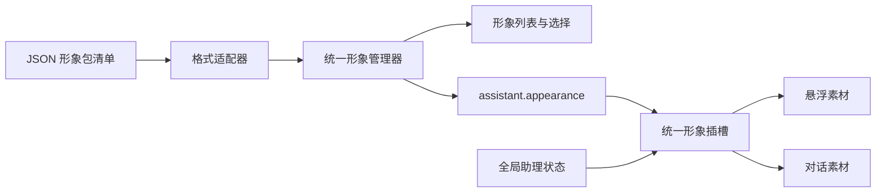

# 20261007-助理形象包与适配器接入规范

## 统一接口与职责

形象包包含角色身份和素材。来源适配器（Source Adapter，仓库定位接口）发现候选；格式适配器（Format Adapter，清单转换接口）解释不同格式；素材适配器（Material Adapter，依赖安装接口）完整下载并本地化引用；管理器负责持久清单与选择；渲染器负责加载、状态变化、尺寸更新和卸载。悬浮和对话容器只调用 `AssistantAvatarSlot`，不识别包格式或角色名称。



Client 与 Host 的注册表分别按各自 services 隔离，内置条目不能覆盖；注册返回幂等注销函数。格式、来源或素材适配器注销后，已经安装的包继续可用。渲染器注销后，使用它的形象回落女生基本形象；重新注册可以恢复。

## 用户操作

进入「助理形象」后，新配置显示生图生成的男女基本形象，默认女生，两者通过固定同源 PNG URL 展示，无需外部引擎。展开「安装形象包」，填写公开 GitHub 仓库、子目录或文件地址，或 HTTP(S) JSON 清单、Live2D 模型、图片 URL；点击「查找形象包」，选中候选后点击「安装并使用」。仓库定位到具体提交，多个角色由用户选择，不自动安装全部角色。

成功后素材保存在独立目录，角色登记到同一列表并立即选择；两个展示位置、加载动画、真实进度和透明预览共用原接口。安装支持取消，失败不会新增记录或改变当前选择。已有选中预设保留兼容入口，可点击「将此形象安装到本地」；新配置不显示未安装第三方预设。「添加自定义形象」和旧外链导入 API 保持兼容，外链模式仍需要来源可访问。

创建与管理列表将大肥鱼等非内置角色标为「外部依赖」。首次创建只列男女基本形象和用户已登记形象，未登记的旧预设 ID 不自动补入或预览；已创建助理的旧选择仍兼容。读取不修改旧资源配置，Host 创建接口同样拒绝未登记的旧预设。

Live2D 的 `l2d@2.1.1` 仅声明为可选对等依赖（optional peer dependency），不进入生产依赖、npm 打包清单或 Client 主包；源码开发把它列为开发依赖，正式 Host 由用户选择 Live2D 形象时确认当前版引擎许可后，从固定 registry 地址下载精确版本、校验 SHA-512 摘要并安装到 CodingNS 自有目录（`DSH_HOME/codingns4dsh/avatar-engine`），不使用 `npm`/`pnpm`，不修改 DSH Profile、插件依赖树或锁文件。Client 只声明必要事件契约，编译无需安装引擎；选择 Live2D 后才通过同源入口读取 Host 已就绪的引擎（自有目录优先、依赖解析回退），缺失返回 503 并回落内置形象。素材安装器只安装素材，不执行或安装第三方插件脚本；引擎下载与素材下载是两个独立确认，撤销许可不卸载已安装引擎。

默认素材目录为 `~/.config/codingns4dsh/assistant-avatar-packages`；配置 `CODINGNS4DSH_STATE_DIR` 后使用其下同名子目录。目录不属于源码、npm 包或 DSH Profile。安装完成后刷新和 Host 重建不再从上游下载素材，但仍需初始化 WebGL；先显示预览的行为保持不变。

## 本地安装边界

GitHub 仓库通过 API 发现 `pet.json`、`avatar.json`、`manifest.json`、`*.avatar.json`、`*.model.json`、`*.model3.json`，宠物清单优先于同目录裸模型。公开 HTTP(S) 地址直接作为清单、模型或图片来源；其他 Git 托管平台目前需要提供资源原始 URL，或注册来源适配器。私有仓库认证、ZIP 包、本地文件上传和第三方插件脚本执行不属于当前安装入口。

安装完整保留 Cubism 的模型、贴图、物理、姿态、用户数据、显示信息、表情、动作和音频；仅重写文件引用。每包最多 256 个资源、总大小 256 MiB，单个素材 32 MiB、JSON 2 MiB，并发下载最多 4 项。资源类型只允许模型、JSON、PNG/WebP/JPEG/GIF 和音频，URL 安装不接收任意脚本。下载不携带宿主凭据，重定向重新校验地址，拒绝本地或私网来源；域名式 Fake-IP 代理可使用，直接访问其保留 IP 仍被拒绝。

目录采用内容版本和原子完成记录，未完成的临时目录不会注册。已安装资源通过固定 GET 入口和记录内文件键读取；不接受磁盘路径或远程代理目标。删除角色清理预览并卸载未被其他角色引用的素材；设置保存失败只回滚本次未使用的新包。原插件的换装、亲密度、语音、会话气泡和 Desktop 窗口不会自动迁入 CodingNS。

| 适配器 | 识别入口 | 转换结果 |
| --- | --- | --- |
| CodingNS | `avatarManifestVersion: 1` | 默认素材、双展示素材、状态映射、作者、许可 |
| Codex | `pet.json` 的 `spritesheetPath` 与 `spriteVersionNumber` | v1/v2 图集；192×208 单帧、8 列 |
| DSH Live2D | `petManifestVersion: 2`、`renderer: live2d` | 模型地址、动作别名、缩放与位置、作者、许可 |
| Cubism | `.model.json` 或 `.model3.json` | 标准 Live2D 模型地址；自动生成稳定 ID |

清单中的相对地址按最终响应 URL 解析，保留目录结构；图片与图集支持浏览器可访问的 HTTP(S) 地址或本站根路径。跨域 JSON、Live2D 模型及其关联文件须允许浏览器读取。导入只转换素材引用，不下载到 Desktop、不安装上游插件、不执行清单里的脚本。

2026-10-07 已只读核验并登记为预设的两套清单，也可单独导入：

- Q 版全身动画：[Codex 大肥鱼 pet.json](https://raw.githubusercontent.com/YunYueSama/codex-deepseek-pet/7661c8b304c5400701f91da01b1a643a207331de/codex-deepseek-pet/pet.json)。原始清单没有作者或许可，单独导入时显示「未声明」；预设补充 YunYueSama 署名和 [ASSET_LICENSE.md](https://github.com/YunYueSama/codex-deepseek-pet/blob/7661c8b304c5400701f91da01b1a643a207331de/ASSET_LICENSE.md) 的实际授权边界。项目署名许可仅覆盖作者有权授权的新增贡献，第三方参考与角色设计权利需另行确认，并非 DeepSeek 官方授权。
- 桌前 Live2D：[DS 鲸鱼娘 pet.json](https://raw.githubusercontent.com/A8Chann/dsh-pet-live2d/185c02bfbb3b886e1a236b5c2ec035cc085b9ca2/dsh-live2d-pet/pets/ds-whale-girl/pet.json)。清单含作者与 CC BY-NC-SA 4.0 说明，导入时原样保留；预设展示中文许可摘要并链接 [NOTICE.md](https://github.com/A8Chann/dsh-pet-live2d/blob/185c02bfbb3b886e1a236b5c2ec035cc085b9ca2/NOTICE.md)。美术要求署名、非商业、相同方式共享，商业用途需分别取得各权利人授权。

这些引用固定到上游提交，不跟随 main 自动变化。插件仅保存已核验的模型数据和来源，不捆绑美术文件；外部资源可用性仍依赖上游服务，也可自行托管有权使用的整套素材。

目录中的大肥鱼 Live2D 预设已采用固定同源缓存入口：source 指向版本化模型清单，Host 按需从原始来源并行下载首屏文件。精简清单只保留助理消费的 Idle/SprayWater 动作，省略未使用的 44 个表情和 6 个动作；模型、贴图、物理和构图数据不变，界面许可摘要标注了清单修改。Host 只代理源码登记的固定文件，失败可重试，缓存不落盘。上述原始 pet.json 仍可导入完整模型，自定义素材继续采用其指定地址；导出预设的同源清单需要目标 CodingNS Host 提供对应资源入口。

## CodingNS 原生包清单

下例声明同一个角色的悬浮动画与对话全身图片。素材路径仅为目录结构示例，需要提供对应文件和可访问清单。

```json
{
  "avatarManifestVersion": 1,
  "id": "my-whale",
  "name": "我的鲸鱼娘",
  "author": "素材作者",
  "license": "填写实际素材许可",
  "asset": {
    "renderer": "spritesheet",
    "source": "./spritesheet.webp",
    "spriteVersion": 2
  },
  "surfaces": {
    "dialog": {
      "renderer": "image",
      "source": "./full-body.png",
      "spriteVersion": 2,
      "stateSources": {
        "thinking": "./thinking.png",
        "speaking": "./speaking.png"
      }
    }
  }
}
```

`asset` 是默认素材，`surfaces.floating` 与 `surfaces.dialog` 可分别覆盖。图片 `stateSources` 为状态差分，缺省状态使用默认图片；某张差分加载失败先回落该角色默认图片。Live2D 使用 `motionGroups` 指定动作组，可附 `live2d: { "scale": 1, "position": [0, 0] }`，缩放范围 0.05–10，位置每轴 -2–2。Live2D 动作组未声明或不存在时使用原有自动识别与待机回落。

统一状态为 `idle/listening/thinking/speaking/waiting/error`。DSH 的 `failed` 转为 `error`，`asking/queued` 可转为 `waiting`，`tool` 可转为 `thinking`；转换在格式适配器内完成。上游的工具专用台词、换装槽位和交互菜单不属于统一素材契约，不会被解释为可执行扩展；需要这些能力时单独注册渲染器。

旧 `id/name/renderer/source/spriteVersion` 配置仍可读写。新增 `package` 保存导入器 ID、清单地址、作者、许可和主页；`surfaces/stateSources/motionGroups/live2d` 都是可选字段。持久清单最多 21 项，包括两个基本形象和原有 19 个自定义名额。旧默认 ID `codingns-default` 改用女生图片，保留原存储字段；男生为 `codingns-basic-male`，读取自动补齐，两者不可覆盖、更新或删除。`selectedId` 可以引用持久清单或旧选择兼容预设，未知 ID 回落默认女生。新增重复 ID 明确拒绝，需要通过 `update` 更新已有角色；新配置不追加第三方预设。

## 管理 API

Client 入口公开 `getAssistantAvatarManager`，Shared 入口公开包、素材和状态类型以及 `assistantAvatarManifest`（原生清单导出）。管理器提供以下方法：

| 方法 | 作用 |
| --- | --- |
| `getSnapshot()/subscribe()` | 读取、订阅稳定持久配置快照；无关语音变化不通知形象订阅者 |
| `list()/getSelected()` | 读取已登记形象与当前角色，兼容旧配置的当前预设；list 引用稳定 |
| `discover(url, signal?)` | 查找仓库或资源地址对应的形象候选，不改当前选择 |
| `setThirdPartyEnabled(enabled)` | 在用户单独同意说明后开启目录并保存协议版本/时间；关闭不删除已安装角色 |
| `getCatalog(signal?)` | 在当前版协议已同意后读取随包目录元数据；不下载完整素材 |
| `installCatalog(id, revision, licenseAccepted, signal?)` | 单独确认所选角色许可后下载、登记并选中；版本已变化时拒绝安装 |
| `installPackage(url, adapterId?, signal?)` | Host 完整安装素材后登记并启用；设置拒绝时回滚未使用的新包 |
| `importPackage(url, adapterId?, signal?)` | 获取清单、适配、校验、加入清单并选择；失败或取消不写入 |
| `add(model)/update(model)` | 添加或更新统一形象数据；男女基本形象不可替换 |
| `select(id)/remove(id)` | 选择或移除已登记形象，删除当前项回落内置 |
| `configure(update)` | 只修改两个展示开关与尺寸 |

```ts
import { getAssistantAvatarManager } from '@jingyi0605/codingns4dsh/client'
import { assistantAvatarManifest } from '@jingyi0605/codingns4dsh/shared'

const manager = getAssistantAvatarManager(services)
const candidates = await manager.discover(repositoryUrl)
// 此示例选第一项；界面中应交由用户从候选列表选择。
await manager.installPackage(candidates[0].url)
const character = manager.getSelected()
const nativeManifest = assistantAvatarManifest(character)
await manager.select(character.id)
```

此处 `services/repositoryUrl` 由调用方提供。管理器所有写入串行读取最新设置快照，检查 ready/writable/revision，只写 `assistant.appearance`，不会覆盖语音或工作区范围。保存被拒时明确失败，不进行本地乐观选择；一次失败不会阻断后续管理操作。`importPackage` 保留旧外链语义，调用方应优先使用新的本地安装入口。

Host 入口公开 `getAssistantAvatarPackages`、`registerAssistantAvatarFormatAdapter`、`registerAssistantAvatarSourceAdapter`、`registerAssistantAvatarMaterialAdapter`；包仓库分别持有 `formats/sources/materials` 注册表。来源适配器返回候选 URL，格式适配器转换到共享 `AssistantAvatarModel`，素材适配器通过 `context.file()/context.model()` 下载数据并返回本地素材地址。未知仓库或渲染格式可以注册扩展，不需增加角色专用代码；普通图片/图集/Live2D 已有通用素材适配器。

增加自定义清单格式时，同一份纯数据适配器分别在 Client（旧导入 API、格式下拉框）和 Host（本地安装）注册；增加渲染格式时，还应在 Client 注册渲染器、Host 注册对应素材适配器。所有注销句柄登记到模块 `context.resources`。新适配器不会覆盖内置通用项，通用 URL 回落不会抢先匹配后注册的仓库适配器。

## 新增格式适配器与渲染器

```ts
import { registerAssistantAvatarAdapter } from '@jingyi0605/codingns4dsh/client'
import { resolveAssistantAvatarSource } from '@jingyi0605/codingns4dsh/shared'

// 在扩展模块 start(context) 中登记，资源管理器负责停用时注销。
context.resources.add(registerAssistantAvatarAdapter(context.services, {
  id: 'vendor-pack',
  name: '自定义图片包',
  matches(value) {
    return typeof value === 'object' && value !== null && 'vendorPackVersion' in value
  },
  parse(value, { manifestUrl }) {
    const pack = readVendorManifest(value)
    return {
      id: pack.id,
      name: pack.name,
      renderer: 'image',
      source: resolveAssistantAvatarSource(pack.image, manifestUrl),
      spriteVersion: 2,
      package: { adapterId: 'vendor-pack', author: pack.author, license: pack.license }
    }
  }
}))
```

`readVendorManifest` 是扩展自己的严格 JSON 解析函数；管理器仍会执行统一模型校验并写入真实适配器 ID 与来源。适配器只返回 JSON 数据，不返回组件或可执行代码。导入选项随注册表变化自动更新。

新渲染方式使用已有 `registerAssistantAvatarRenderer`，传入稳定 ID 与 React 组件。组件接收 `model/state/surface/size/onError`；用 effect 管理加载和销毁。渲染器在注册后自动出现在手工素材格式选择框；内置 `builtin/image/spritesheet/live2d` 也通过同一注册表解析。

组件还可接收 `onLoadProgress?: (progress: AssistantAvatarLoadProgress) => void`，公开类型从 Client 入口导出。注册项声明 `reportsLoading: true` 后，插槽自动显示统一动态占位；`initialLoadPhase` 可选 `engine/resources`，默认 `resources`。旧扩展不声明时不显示强制占位，无需修改。渲染器加载开始报告 `phase: 'resources'`，真实文件事件提供 `loaded/total`，渲染准备报告 `rendering`，完成报告 `ready`；失败调用 `onError`，卸载后不再发送状态。未知文件数不要提供假的百分比。

加载耗时可提供 `elapsedMs/resourcesMs`。统一插槽新增可选渲染器属性 `diagnostics?: boolean`，只有 Host 确认是专用 dsh-stage0 服务时才为 true；其他环境默认关闭。渲染器仅在该标识开启时采集计时与缓存快照，真实 `phase/loaded/total` 始终正常上报。需要 Host 缓存提示的渲染器声明 `reportsCache: true`，并提供经过验证的 `cacheBefore/cacheAfter` 快照；没有真实快照时在 Stage0 显示未知。正式环境即使收到兼容扩展的诊断字段，也不显示文字、摘要或调试 tooltip。插槽根据环境、注册项和加载数据决定反馈，不判断渲染器 ID。缓存证据字段包含缓存代际 `generation`、首屏总数、成功缓存数、进行中数量和 Host 累计下载次数；只在同一代际内比较下载差值，不能把 HTTP 缓存头、加载快慢或事后缓存数量当成本次命中证据。

大肥鱼 Live2D 预设仅在 Stage0 加载时显示「加载前 Host 缓存」，完成后的形象底部保留缓存数量、新增下载数和总耗时；将指针放到摘要上可查看完整说明与资源就绪耗时。新增下载数仅在前后诊断均成功时显示，不能把未知当成 0。资源就绪耗时包含引擎处理与图片上传，不是纯下载计时。固定状态入口为同源版本目录下的 `cache-status.json`，读取不下载素材，响应 `no-store`；Stage0 Client 诊断上限 250ms，失败不阻止显示，正式 Client 不请求该入口。Host 进程和模块未重建时缓存可跨路由重新登记复用；缓存不落盘，不保证跨进程重启或模块热替换保存。

跨刷新恢复必须区分资源缓存和活的渲染实例。不能通过保存 `ready/loaded` 来省略初始化；所有异步渲染器仍须报告真实完成状态。统一插槽现已接入本地透明预览，内置 Live2D 自动捕获有效帧并保存，刷新时先显示本地图片、后台初始化后替换，见[实现记录](../开发记录/20261007-统一形象本地透明预览实现记录.md)。

需要使用统一预览的渲染器声明 `previewVersion: '1'` 和 `reportsLoading: true`，并接收 `onPreview?: (preview: AssistantAvatarPreview) => void`。`AssistantAvatarPreview` 与 `captureAssistantAvatarPreview` 从 Client 入口导出；预览数据包含 `{ blob: Blob, width: number, height: number }`，只能是非空 PNG，最长边不超过 512px、文件不超过 512KiB。自定义画布可调用公共捕获函数，其他引擎也可自行生成同等数据。

成功绘制后提交预览，再报告真实 `ready`；捕获失败仍正常报告 `ready`，不能让预览阻断主形象。捕获函数可传 AbortSignal，卸载后应取消；渲染器不得向已销毁的插槽提交迟到结果。统一插槽处理存储、读写取消、临时图片地址释放和淡出。`previewVersion` 在渲染器构图或捕获策略变化时递增，资源版本由包的版本化地址区分；插槽不会按渲染器 ID 判断预览能力。旧扩展无需声明这些可选字段。

预览数据库按网页来源隔离，最多保存 8 张、30 天过期；写入清理同一角色和展示位置的旧版本，删除自定义形象清理其预览。浏览器清理网站数据、禁用存储或外部素材不允许截图时，回落原有加载反馈。图片和精灵图的全身展示沿用原资源加载流程，暂未声明全身预览捕获能力；自动头像的独立读取与裁切见下节。

## 自动头像接口

助理消息与全局按钮使用统一静态头像，不各自持有动画实例。扩展渲染器可新增可选 `portraitVersion: '1'`、`createPortrait(model, signal): Promise<AssistantAvatarPreview | undefined>`，返回透明方形 PNG，最长边 256px、文件不超过 512KiB；内置生成器输出 128px。构图或生成策略变化时递增版本。函数遵守取消信号，失败可返回 `undefined`，不得改写形象设置或持有麦克风。

只有既有 `previewVersion/onPreview` 的扩展继续兼容：服务可裁剪本地全身预览，插槽成功提交新帧时也会派生头像。完全没有预览或头像接口的旧扩展仍可渲染原形象，头像使用默认回退。Client 公共入口导出 `AssistantAvatarPortrait` 和 `useAssistantAvatarPortrait`，其他入口应复用它们，不能直接初始化 Live2D 或读取图集整张图片充当头像。

头像取对话素材的待机构图，生成后独立持久化，不新增清单字段或第三方素材文件。透明边距和上部轮廓裁切适合普通直立角色，特殊构图可由扩展提供自己的头像生成函数；不依赖网络人脸识别。跨域素材须允许 Canvas（画布）读取像素，建议使用统一安装器的同源本地素材入口。

## 用户头像微调接口

渲染器可另提供 `createPortraitSource(model, signal): Promise<AssistantAvatarPreview | undefined>`，返回用于编辑的完整静态帧，最长边 512px、PNG 不超过 512KiB。只在用户打开微调时调用，不能在普通消息或按钮订阅中加载第二份模型；Live2D 优先复用相同资源与构图的透明预览，确需临时实例时捕获后立即销毁。精灵图只返回待机首帧，不能返回整张图集。未实现的新旧扩展仍可微调既有头像。

交互统一采用 `react-easy-crop`，裁剪结果交给头像服务，不能改写原素材。用户保存的 PNG 与原始帧百分比裁剪范围 `cropAreaPercentages: { x, y, width, height }` 一起存入独立的 `codingns-assistant-avatar-portrait-overrides` 数据库（IndexedDB），按角色、资源及适配器版本隔离、最多 21 项，不应用临时预览的有效期。百分比坐标用于再次打开时恢复构图；回退已裁缩略图时不套用原图范围。普通预览无需提供此可选字段。

手动设置优先于自动头像与新动画帧，成功持久化后才能更新所有消费者。保存失败或取消保留原头像；角色删除同时清理手动设置和派生缓存。该设置仅保存于当前浏览器，清理网站数据会移除，不能声明跨设备同步或不可丢失。

## 验证边界

源码定向测试可证明清单适配、持久配置、订阅稳定、连续切换、删除回落与双展示选材。浏览器网络策略、模型实际构图、WebGL 动画和列表点击必须另做实机验收，不以 JSON 解析成功代替模型显示成功。
