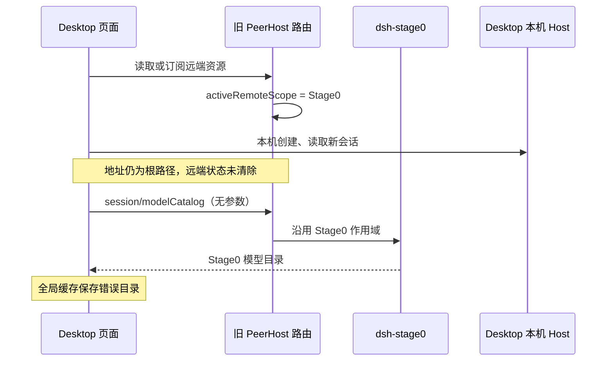

# PeerHost 前台模型目录作用域隔离修复记录

日期：2026-10-07

## 核心判断

✅ 值得修复。这是 PeerHost 页面路由的数据归属错误：代码把最近一个远端请求的 Host 当成前台模型目录的 Host。本机自定义提供商已正常加载，却被另一个 Host 的目录覆盖。重新填写配置或重启不能消除这个逻辑错误。

品味评分：🔴 原有作用域推断有根本缺陷。资源请求、后台流和前台选择是三个不同概念，不能共用一个“最近远端作用域”。本次删除该状态，直接读取原生前台选择。

## 现场证据与边界

用户确认：

1. Desktop 的模型设置页存在自定义提供商 `glor`，但本机工作区新建 DSH 会话只显示官方 DeepSeek 模型；重启仍然如此。
2. 从 dsh-stage0 经 PeerHost 访问 Desktop 时，可以看到 Desktop 的第三方模型。
3. 移除 PeerHost 后，Desktop 本机模型选择恢复正常；此前错误显示的实际是 dsh-stage0 的模型目录。

故障页面的只读诊断结果进一步区分了数据源：

| 检查入口 | 结果 |
| --- | --- |
| 页面地址 | `dsh-app://app/` |
| 原生目录缓存 | `ready`，只有 `deepseek-official` |
| 重新调用页面 `connection.rpc` 的 `session/modelCatalog` | 仍只有 `deepseek-official` |
| 直接查询本机 Host 的目录 | `glor`、`deepseek-official`、`deepseek-account`，`failures: []` |

这说明既有目录缓存错误，也有新的请求路由错误。仅清缓存会再次读到错误 Host；第三方配置、密钥环境变量及模型发现不是本次故障点。

尚未采集到第一次污染作用域的请求日志，因此不能断言一定是某次手动打开远端会话触发。旧代码允许远端页面读取、后台保留资源及流请求写入该状态，已足以解释故障；用户的 PeerHost 移除对照验证了问题所属层。

## 代码层面的原因

### 1. 无参数目录需要 Host，旧代码从请求历史猜测

DSH 的 `session/modelCatalog` 原生调用没有 Session 参数。它描述整个 Host 的可用模型；所有会话模型选择器共用一个 Host 代际目录缓存。

旧版 `createPeerHostPageTransport` 保存页面级 `activeRemoteScope`，通过 `rememberNativeScope` 在远端原生 RPC（远程过程调用）和流请求时更新它。无资源 ID 的 `session/modelCatalog`、`cli/catalog` 和 `cli/models` 随后沿用这个状态。

问题是 `session/page`、`session/follow`、`workspace/follow` 可以为后台资源执行。后台远端 A 或 B 的请求成功，不等于用户已经切换前台，更不能决定本机会话的模型目录。

### 2. Desktop 的根地址无法清掉远端状态

旧目录逻辑试图通过 `/workspaces/<id>` 路径识别本机工作区。Desktop 的地址是 `dsh-app://app/`，切换本机或远端会话都不依赖这个路径。

DSH 真正的导航状态是 `uiWorkspace.selection`：`replaceMain` 写入当前 `sessionId` 与可选的 `subagentAddress`，`clearMain` 写入空对象。rc.2 与 alpha.1 都使用这份 Store（可观察状态存储），并将选择持久化为 `dsh.sessions.current`。

旧代码既没有读取它，也没有订阅它。本机 `session/create` 或 `session/page` 不会清掉远端状态；Desktop 本机原生调用还可能直接委派原生 Connection，根本不进入原来记录作用域的钩子。

### 3. 全局目录缓存放大了错误路由

DSH 的 `ModelDirectoryResolver.catalog` 在同一页面被所有会话共享。`ready` 目录会被复用，不会因为新建本机会话就重新加载。

旧代码又按照“最近请求作用域”重置这个全局缓存，导致后台请求既能改变后续目录的路由，也能触发一次错误 Host 的重载。

典型错误链路如下；远端请求可以来自前台，也可以来自后台：



### 4. 为什么反向访问反而正确

从 Stage0 访问 Desktop 的远端会话时，目标作用域恰好是 Desktop，转发后拿到的是 Desktop 完整目录。这条链路证明 Desktop 后端能提供第三方模型。

而 Desktop 本机页面保留的错误作用域是 Stage0，所以读到 Stage0 的目录。两种现象来自同一个路由缺陷，并不矛盾。

## 修复方案

实现位于 [peer-host.ts](../../src/client/features/peer-host.ts)。

### 数据归属只有一个来源

删除 `activeRemoteScope` 和 `rememberNativeScope`，RPC 或流请求不再修改前台目录所属 Host。

目录路由规则现在统一为：

| 请求数据 | 路由来源 |
| --- | --- |
| 显式远端资源 ID | 该资源自身的作用域 |
| 显式本机 `sessionId`、`workspaceId` 或 `parentSessionId` | 本机原生路径 |
| 无资源 ID 的原生模型目录或 CLI（命令行接口）目录 | `uiWorkspace.selection` 的前台 Host |
| 原生选择为空或选择本机会话 | 本机 |
| 旧宿主没有原生导航服务 | 仅兼容显式虚拟工作区 URL，根地址默认本机 |

原生选择存在时，残留 URL 不能覆盖它。刚创建的远端会话继续使用既有 pending（等待聚合确认）绑定；摘要暂时缺行或 pending 到期后，目录还可以从虚拟 ID 的 Host 部分定位已知目标 Host，避免静默切成本机目录。

### 缓存跟随前台 Host

新增 `watchNavigation`，通过原生 `uiWorkspace` 注入生命周期订阅 `selection`。服务晚挂载时自动订阅，服务释放或模块停用时释放监听。

前台 Host 变化才触发原生目录 `resetGeneration`；同一 Host 的工作区或会话切换不重复刷新。聚合数据首次到达时重新解析当前选择，修正早于聚合恢复的远端选择。

继续使用 DSH 自己的代际机制，不复制一份目录状态：

- 切 Host 时清空旧模型与思考强度元数据，并立即重载。
- 旧代际未完成请求即使晚到，也不能写回新代际缓存。
- 停用 PeerHost 时先按资源逆序还原路由、投影和订阅，再重新加载本机目录。

### 兼容性与风险

保持原生本机 RPC、二进制附件解析、错误信封、实时流与双向上传通道不变，不增加 `connection.rpc.open`，因此 Desktop 原生流多路复用的启动与重连规则保持不变。

最大的兼容风险是把后台请求误当导航，或破坏远端新会话尚未聚合时的路由。本次通过真实选择 Store 消除前一种特殊情况，并保留资源 ID 和 pending 路由覆盖后一种情况。没有变更 Host 协议、模型配置、凭据或会话数据。

## 验证

### 源码回归：112 项通过

新增 [前台模型目录回归测试](../../tests/peer-host-model-navigation.spec.ts) 与 [导航测试夹具](../../tests/peer-host-navigation-fixture.ts)，并将原有目录测试改为显式前台导航，不再把远端请求冒充导航。

新增 11 个场景覆盖：Desktop 根地址恢复本机会话、远端切回本机、新建会话、多 Host 后台并发请求、同 Host 切换、残留 URL、显式本机 CLI 请求、无参远端 CLI 请求、pending 新会话、聚合晚到、pending 到期、导航监听释放与旧宿主降级路径。

运行命令直接在内存加载源码，不运行构建脚本，也不修改 `data/build/dist`：

```bash
node --import ./tests/register-source-loader.mjs --test \
  tests/peer-host-model-navigation.spec.ts \
  tests/peer-host-native-connector.spec.ts \
  tests/peer-host-desktop-transport.spec.ts \
  tests/dsh-peer-host-preboot-shim.spec.ts \
  tests/peer-host-native-store-projection.spec.ts \
  tests/peer-host-native-projection.spec.ts \
  tests/peer-host-aggregated-transport.spec.ts \
  tests/peer-host-native-protocol.spec.ts \
  tests/peer-host-virtual-registry.spec.ts \
  tests/peer-host-workspace-tag.spec.ts \
  tests/peer-host-workspace-tab.spec.ts \
  tests/peer-host-local-workspace-order.spec.ts \
  tests/peer-host-session.spec.ts
pnpm exec tsc -p tsconfig.json --noEmit
```

结果：112 个测试通过，0 失败；TypeScript 类型检查退出码为 0。

### 原生目录代际验证：两个版本通过

额外只读加载独立参考安装中的 DSH `0.2.0-rc.2` 与 `0.2.1-alpha.1` 的 `dsh-client-ui-model-selection/lib/client.js`，在内存中实例化实际 `ModelDirectoryResolver` 和 `ModelDirectory`，接入本次源码路由与真实 `dsh-client-store` 引擎；Host 网络边界使用内存响应，服务注册使用最小适配。

两个版本均验证了：

1. 本机目录为 `glor`，后台远端 `session/page` 不改变目录。
2. 切换远端立即隐藏旧目录。
3. 远端目录请求延迟期间切回本机，恢复 `glor`。
4. 释放延迟远端响应后仍保持 `glor`，旧代际结果被丢弃。
5. 后续本机与远端切换分别得到各自目录。

这是对实际原生目录及其代际机制的验证，不是只检查重置函数调用次数；但它不代替安装后的 Desktop 界面验证。

### 原生服务注入生命周期验证

另外使用实际 Cordis（DSH 的服务与插件生命周期框架）`Context`、`Service` 和真实状态引擎进行纯内存验证：先注册导航依赖注入，再挂载 `uiWorkspace`，确认前台切换能触发目录更新；释放注入后继续改变选择，确认监听已清理。验证通过，未启动任何服务进程。

## 交付范围

本次交付为仓库源码、回归测试与本文档。没有构建、安装插件、修改 Desktop Profile、启动或重启 Desktop/Stage0，也没有推送或发布。

按照仓库的 Desktop 隔离规则，本次未将改动装入 Desktop。当前已安装版本不会因源码修改自动更新，实际 Desktop 生效及界面验收需要后续明确授权的部署操作。
