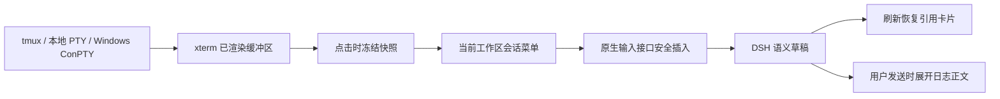

# 终端日志分享与会话引用实现记录

## 核心判断

值得做。把用户正在看的日志冻结成文本，加入指定会话草稿，能直接减少复制粘贴和会话切换。实现落在现有终端视图与原生草稿之间，不增加终端后端、日志服务或独立缓存。

本次完成四步：统一快照提取、目标会话选择、带来源的文本插入、原生引用卡片与草稿恢复。随后根据用户反馈，将复杂表单改为会话菜单，并增加选区复制与分享入口。

## 使用方式

1. 打开右栏终端，点击标签栏上的“分享终端输出至会话”图标。
2. 直接显示当前工作区的会话菜单，首项默认选中“新建会话”。下方排除未发送的草稿，按更新时间倒序显示最近 5 个已有会话，包含当前会话时使用真实标题，不再以“当前会话”置顶。点击“更多会话”每次展开 5 项。
3. 点击“新建会话”，在当前工作区创建新身份并将日志引用卡片加入新草稿；点击已有会话则加入其原草稿。界面切到目标会话，原有问题、附件和引用保留，用户补充问题后自行发送。
4. 也可以在终端拖选文字，松开后在选区附近显示“复制 / 分享”浮动按钮。复制保留完整选中文字；点击分享，冻结该选区并打开同一个会话菜单。
5. 点击对话输入框中的终端日志引用卡片，打开小型悬浮模态框查看内容。弹层显示终端名、行数、采集时间及日志原文；长日志上下滚动，长行左右滚动，可通过关闭按钮、Esc 或点击遮罩关闭。

会话行参考侧栏样式：左侧显示适配器图标，中间显示会话标题，右侧显示“刚刚、3分钟、8小时”等相对更新时间。长标题省略，悬停标题显示完整名称，悬停图标显示适配器名称，悬停时间显示完整日期。“新建会话”使用加号图标及原生选中背景，不显示旧会话的时间。

图标复用 `providerVisual` 与侧栏的适配器绑定缓存；绑定变化时通过 `useSyncExternalStore`（React 的外部状态订阅接口）即时更新，不按会话行增加请求。摘要中的适配器作为后备信息，无显式绑定时遵循原生 `dsh` 默认值，未知适配器保留中性占位。时间复用 DSH `relativeTime`（相对时间分段函数），中文、英文文案归插件词典所有。菜单打开时共用一个每分钟更新的时钟，关闭后释放；缺少更新时间显示“—”，不冒充“刚刚”。

范围、跨工作区搜索和加入方式不再作为表单配置。工具栏入口固定最近输出，选区入口固定用户选中的文字；最近输出保留尾部，选区保留开头。每个快照最多 200 行、32 KiB 的 UTF-8（文本编码）正文，选区截断时在菜单提示实际保留的范围。备用屏幕没有回滚历史，工具栏入口改取当前屏幕。

再次点击分享按钮、Esc 或点击菜单外部可取消选择，取消不会修改草稿。加入过程中禁止重复插入，失败在菜单显示原因。会话被归档、目标未就绪、草稿提交中或版本冲突时拒绝插入，不覆盖原有文字。选区按钮在开始拖选、清空选区、滚动或窗口失焦时隐藏；菜单已打开后继续使用冻结选区，终端新输出不会替换待分享的内容。

## 数据结构与数据流

核心数据是 `TerminalTextSnapshot`（固定文本快照），包含终端 ID、名称、来源 Host、工作区、启动目录、Shell、采集时间、范围、行数、截断标记和正文。目录字段明确表示启动目录，不冒充执行 `cd` 之后的实时目录。

仓库 Windows 后端实际使用 ConPTY（Windows 原生伪终端），没有单独的 WinPTY 分享分支。三种后端的输出都经过同一个 xterm，因此通过它的公开 `getSelection()` 和 `buffer.active` 读取纯文本即可，不需要分别调用 `tmux capture-pane` 或读取 Windows 原始控制序列。

软换行按 `isWrapped` 合并成逻辑行，去掉末尾空屏行；按 Unicode 码点限制 UTF-8 大小，避免拆开中文或 emoji。点击入口时只采集一个固定快照，不再同步读取多个可切换范围。读取器按终端视图对象登记，同 ID 的不同 Host 视图不会相互覆盖，重连后的旧清理函数也不会删除新读取器。

## 草稿插入与引用保存

DSH 能力 `conversation.draft-share` 在适配器中集中装配。目标列表复用原生会话 Store（状态容器）；当前工作区摘要不完整时，补读一次 `remote.session.list`，不读取会话正文。工作区归属来自原生工作区快照，过滤归档会话和 `blank === true` 的未发送会话，只向菜单返回所需数量的当前工作区目标。新建操作与最近 5 个已有会话分开，不再伪造未进入摘要的当前会话。PeerHost 虚拟会话 ID 保持完整，交给原生导航和已有会话路由。

草稿过滤在排序和数量限制之前完成，覆盖原生缓存、补读摘要及 PeerHost 投影，草稿不占最近 5 项的名额。依据原生 `blank` 标记判断，不依据“未命名会话”标题或输入框是否有待发送文字；正式会话已有输入草稿仍可作为目标，缺少该字段的旧摘要保持兼容。当前会话是草稿时仍通过工作区成员关系提供“新建会话”入口，新建后的日志卡片仍能安全加入新草稿。

新建调用原生 `sessions.create({ workspaceId })`，不传已有 `sessionId`，避免“新建”意外复用已有空白会话。工作区通过发起分享的会话在原生快照中的成员关系确定，不降级到其他当前工作区；虚拟工作区 ID 原样交给已有 PeerHost 路由。新身份创建成功后，复用原有安全插入流程导航、保留引用并保存草稿，不自动发送消息。新建使用原生默认适配器，不复制原会话的消息或草稿。

同一固定快照的创建结果通过 `WeakMap`（弱引用映射）保留；卡片插入失败后重试会复用已创建的目标，创建本身失败则允许重新尝试。缓存不持有快照对象，桥接服务换代或停用时丢弃，避免跨运行时复用旧目标。引用未就绪时，在创建会话之前拒绝操作。

DSH `0.2.1-alpha.1` 的 `session/list` 返回完整摘要，未提供工作区过滤和数量限制。因此“初始 5 项”是插件的菜单读取和展示范围，不表示底层 Remote 仅传输 5 条；完整原生缓存可用时不增加 Remote 请求。

插入先调用 `uiWorkspace.openSession`，再通过目标的 `sessions.scope` 获取 `conversation.input.for`。只在可编辑阶段插入；使用原生 `captureInsertion` 的坐标和 `draftRev`（草稿版本），将插入区间折叠到选区末尾，避免覆盖目标会话已选中的文字。成功后调用原生草稿保存和聚焦接口，不调用提交接口，也不使用整段 `setDraft` 替换。

日志引用源名为 `codingns-terminal-log`。`ref` 直接携带有版本的快照 JSON（结构化文本数据），原生草稿保存引用时同时保存正文。发送时 `inputTriggers` 的序列化器读取快照，展开为带元信息和文本围栏的用户消息。围栏长度避开日志自身的反引号序列。刷新恢复不需要原终端、临时文件或插件内存缓存。

引用源登记序列化器与卡片预览回调，不增加 `@` 菜单候选。加入方式固定为日志引用卡片，引用服务缺失或停用时显示不可用原因，选区复制仍然可用。引用插入因草稿变化失败时直接报错，不回退文本造成重复插入。日志作为普通用户消息中的调试资料传递，不赋予终端控制能力。

## 卡片点击预览

引用源通过 DSH `InputTriggerSource.openReference`（引用点击回调）接收原生编辑器的卡片点击，读取 `ref` 中已保存的快照，不重新采集终端，也不修改或提交草稿。预览状态由现有 `TerminalSharing` 持有，订阅函数和快照引用保持稳定；视图注册到根级 `shell.overlay`（全局浮层插槽），右栏终端未打开时仍可预览恢复后的卡片。

弹层复用原生 `Modal`（模态框）和 `Button`（按钮），宽度最多 560px、高度最多 420px，并受可用视口约束。内容区最多 320px 高，以等宽纯文本保留空格、换行和制表符，支持滚动与文字选择；HTML 字符由 React 自动转义。原生模态层负责遮罩、Esc、焦点限制及关闭后的焦点恢复。损坏引用显示局部错误，引用源重新注册、服务停用或插件销毁时关闭弹层，并拒绝旧回调。

## 兼容边界

本地依赖源码确认：DSH `0.2.1-alpha.1` 的会话输入模型在返回前完成草稿导入，保存完整语义草稿（正文与引用），并提供 `persistDraft`。组件挂载时绑定保存器并保存当前文档，因此跨会话插入不需要等待编辑器 DOM（页面元素）挂载。

DSH `0.2.0-rc.2` 仅保存纯文本镜像，并在对话组件挂载后才导入旧草稿；它既不能保证引用恢复，也可能让跨会话插入绕过旧草稿导入。新分享能力因此限定为 `0.2.1-alpha.1`，其余版本给出不可用提示，既有终端和插件整体兼容范围不变。运行时缺少保存接口时，在实际插入之前失败。

## 修改位置

| 文件 | 职责 |
| --- | --- |
| `src/shared/contracts/terminal-share.ts` | 快照与目标会话契约 |
| `src/client/terminal/snapshot.ts` | 提取、裁剪、引用编码与正文格式化 |
| `src/client/terminal/sharing.ts` | 读取器与引用源生命周期、分享协调 |
| `src/client/terminal/log-preview.ts` | 卡片点击后的日志模态预览 |
| `src/client/terminal/share-menu.ts` | 当前工作区的会话菜单和固定卡片插入 |
| `src/client/terminal/selection-actions.ts` | 选区浮动按钮、完整复制与同菜单分享 |
| `src/client/terminal/ui.ts`、`xterm-view.ts`、`styles.ts` | 终端工具栏入口和 xterm 绑定 |
| `src/dsh-capabilities/client/terminal-sharing-adapter.ts` | DSH 列表、导航和草稿接口适配 |
| `src/dsh-capabilities/types.ts`、`routes.ts`、`matrix.ts` | 新能力登记与版本路由 |
| `src/client/locales/terminalAuth.ts` | 菜单、选区操作和分享正文的中文、英文词条 |
| `tests/terminal-sharing.spec.ts` | 快照、引用、草稿保护与跨 Host 行为验证 |

能力报告生成脚本同时补上共享兼容范围常量的解析，避免现代路由被报告漏掉。源码测试加载器的转换目标改为与项目一致的 ES2022，在内存转换标准装饰器，让 Node 22 能运行能力注册表测试，不执行构建。

## 验证

采用 `tests/register-source-loader.mjs` 直接加载源码，没有构建或清理产物。初次实现的 127 项定向验证通过。菜单与选区改造后，定向验证涵盖终端分享、原有终端 UI、终端模型、终端恢复、DSH 能力注册表与国际化守卫，共 122 项通过、0 项失败（包含同期新增的终端标签记忆验证）。`pnpm run typecheck` 和 `git diff --check` 通过；国际化守卫无阻断项，异常与日志中文仍按项目规范作为非阻断告警。

分享测试包含中文与 emoji、软换行、备用屏幕、继续输出后的固定快照、行数与字节截断、引用 JSON 恢复、序列化取消、已有草稿与附件保护、输入锁定、版本冲突、引用服务缺失时禁止文本降级、终端重连、会话摘要错误、归档竞态和完整虚拟 ID 导航。新增覆盖当前工作区过滤、最近会话排序、初始 5 项、缓存与单次摘要补读、选区末端定位、拖选完成后弹出、滚动隐藏和销毁清理。

适配器图标与时间展示调整后，重新运行类型检查，以及终端分享、终端 UI 和国际化守卫的 55 项定向测试，全部通过。没有为纯展示改动新增重复实现的测试，尚未进行真实浏览器的视觉回放。

“新建会话”改造后，类型检查及 59 项定向测试全部通过。新增四项行为验证覆盖当前工作区创建新身份、固定日志卡片写入新草稿、插入失败重试不重复创建、创建失败可重试、工作区丢失时拒绝降级、原草稿保护和远端虚拟 ID 保留。国际化检查无阻断项，`git diff --check` 通过；终端样式中的中文说明移至模板字符串外的 TypeScript 注释，避免守卫误把 CSS 注释当成界面文案，保留已有修饰键样式。

草稿过滤修复后，类型检查及 61 项定向测试全部通过。新增回归覆盖本地及远端草稿排除、未命名正式会话和旧摘要保留、缓存及补读路径，以及活跃摘要的草稿状态优先；同时验证最新草稿不占最近 5 项名额、从草稿发起新建仍能写入日志卡片、已有会话的输入草稿继续保留。国际化守卫无阻断项，`git diff --check` 通过。

卡片点击预览改造后，类型检查及 64 项定向测试全部通过。新增行为验证覆盖恢复后的固定快照预览、连续打开不同卡片、快照与订阅稳定性、关闭及服务停用清理、旧回调拒绝、损坏引用处理、日志空白与中文保留、HTML 转义及截断提示；确认预览不导航、不写草稿、不发送消息。国际化守卫无阻断项，`git diff --check` 通过。

分批提交前，两批功能的暂存源码分别通过独立类型检查；暂存内容的独立副本通过全部 64 项定向测试，报告重新生成后与暂存版本完全一致。验证副本排除了其他会话的未提交源码，工作区中的 PeerHost 国际化告警没有纳入本次提交。

本次开发与验证未启动或重启 Stage0、dsh-web 或 Desktop，未安装插件、推送或发布；源码、测试、报告和说明按功能分批提交。尚未进行真实浏览器中的终端点击与刷新回放，也未在 Windows 真机执行回放。运行时回放需要在用户指定的 Stage0 环境中另行安排。
