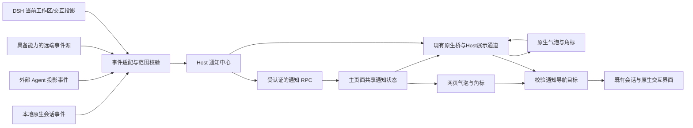

# 设计文档 - 全局助理会话提醒与情绪反馈

状态：In Progress（源码阶段 0—3 已完成，阶段 4 实机验收待执行）

## 1. 概述

### 1.1 目标与核心判断

值得做：用户同时运行多个会话时，需要一个准确的待办入口。现有全局助理已经拥有形象、悬浮容器与受管工作区，新增独立通知服务即可复用这些能力。

关键数据关系是「Host + 会话 + 轮次或请求 → 一条通知 → 一个经过校验的导航目标」。复杂度应集中在事件标准化和身份校验，展示层不判断执行成功，也不推断问题是否已回答。最大风险是误报成功、跨 Host 错跳，以及把关闭气泡误当作批准请求。

本设计覆盖需求 1—9。实现顺序为本地通知闭环、可选情绪与原生窗口、远端接入、授权实机验收。源码核查依据见 [现有实现核查与接入边界](docs/20261009-现有实现核查与接入边界.md)。

### 1.2 技术约束

- 复用现有 TypeScript、客户端组件、Host RPC（远程过程调用）和原生会话桥，不增加数据库或新的常驻服务。
- 通知的展示历史与确认状态由 Host 内存持有；审批/提问是否仍待处理以读取时对会话事件流的实时扫描与 DSH 会话投影为事实，不依赖助理自建持久待办表、语音初始化、LLM（大语言模型）索引或摘要。
- 复用既有认证、受管工作区注册、PeerHost 路由及助理生命周期。标题和错误摘要只作为普通文本展示。
- 不修改现有六种 `AssistantAvatarState` 的含义，不更换形象包版本，不强制安装引擎或模型。
- 用户已批准并行源码实施。验证遵守禁止主动构建、启停与 Desktop 操作的仓库边界。

## 2. 架构与职责

### 2.1 数据流



原生伴随窗口只收到展示数据及不透明通知 ID，不直接取得会话控制能力。通知变化不触发会话索引。PWA（渐进式网页应用）通知继续沿用原有流程，本 Spec 不改变其推送行为。

### 2.2 模块划分

以下位置已按源码实施，保持一处通知事实所有者；页面与原生各自展示，不另建会话事件源。

| 模块/位置 | 职责 | 输入 | 输出 |
| --- | --- | --- | --- |
| `src/shared/assistant-notifications.ts` | 共享通知类型、长度和配置校验 | 原始 DTO（数据传输对象） | 安全通知快照 |
| `src/host/features/assistant-notification-events.ts` | 各来源协议归一、请求身份与范围校验；按 DSH 会话投影与读取时会话事件流扫描重建待办 | 真实会话事件、`workspaceRegistry`、`sessionProjections.userQuestions`、会话对象 `snapshotEvents` | 标准化事实 |
| `src/host/features/assistant-notifications.ts` | 去重、队列、修订、请求生命周期、容量 | 标准化事实、展示确认 | 通知快照、可信目标 |
| `src/host/features/global-voice-rpc.ts` | 绑定助理生命周期和已有 RPC 命名空间 | 助理配置、Host 服务 | 通知接口与销毁逻辑 |
| `src/client/features/assistant-notification-store.ts` | 单个共享读取循环、确认和导航 | RPC 快照、点击 | 展示模型和导航结果 |
| `src/client/avatar/notification-bubble.ts` | 共用气泡、列表、状态文字和按钮 | 安全展示模型 | 展示确认、查看、收起动作 |
| `src/client/features/global-voice-assistant.ts` | 组合语音、通知及当前形象 | 两套独立状态 | 网页和原生展示帧 |
| `src/client/avatar/desktop-bridge.ts`、`src/host/desktop-assistant/` | 扩展既有伴随通道、回传动作、布局 | 展示帧和受限动作 | 原生渲染与主窗口导航 |
| `src/dsh-capabilities/client/assistant-session-navigation-adapter.ts` | 检测并复用 DSH 会话导航能力 | 校验过的目标 | 原生工作区/会话打开结果 |
| `assistant-notification-source.ts`、`assistant-peer-notifications.ts` 与既有 PeerHost 网关 | 有界增量来源、当前请求、认证传输和能力代次；本机来源读取时重查当前快照 | 已确认来源事实 | 带 Host 与连接代次的事实 |

### 2.3 所有权与初始化

通知中心跟随全局助理服务创建和销毁，独立于麦克风、实时通话及索引任务。本机展示要求模块启用、助理已创建、悬浮形象开启、通知总开关开启及存在受管工作区；关闭时清理展示队列，不停止原会话。

当前原生事件的观察独立于本机展示开关，终态结算同样不依赖展示范围；认证远端消费者按指定工作区取得来源租约。审批与阻塞式提问由读取时对会话事件流的实时扫描判定（未闭合回合内的未决请求；没有活跃 Agent 的残留回合忽略），可跨重启续答的定时提问以 DSH 提问投影为准；每次读取都按当前非隐藏、非归档会话重新校验。因此本机关闭通知或移除显示范围不会截断其他 Host 正在读取的请求生命周期，重新开启只恢复 DSH 仍存在的待办，关闭期间的终态不补弹。单类型开关只清理该类型，保留其他待办的身份、已读和收起状态。

优先消费 `nativeSessions.subscribe`；仅在该能力缺失时使用现有 `session/event` 与 `session/flush` 回退。若桥有重复投影，仍用逻辑事件键去重，不能让两套订阅各生成一条通知。

网页形象与原生形象复用同一个 Host 通知中心；原生另有 Host 时钟直接同步安全快照，避免主页面隐藏时的浏览器计时限流。原生处于可用状态时沿用现有网页形象抑制规则。通知层不另建语音会话、助理实例或悬浮窗口进程。

## 3. 数据与状态模型

### 3.1 身份模型

| 字段 | 所有者 | 用途与约束 |
| --- | --- | --- |
| `hostId`、`sessionId` | 会话注册与事件源 | 联合会话键沿用 `JSON.stringify([hostId, sessionId])` |
| `workspaceId` | 受管工作区注册 | 用成员关系校验，不能仅比较当前目录 |
| `turnId` 或已验证轮次序列 | 运行协议 | 完成/错误的稳定去重身份；同轮失败后禁止再报成功 |
| `requestId`、`requestKind` | 原生交互请求 | 提问/审批按请求去重，同会话可同时保留多条 |
| `logicalKey` | 通知事件适配层 | Host、会话、轮次或请求组成；不含重连后会变的传输事件 ID |
| `generation` | 通知中心及连接管理 | 重置、范围变化、重连后拒绝旧路由与迟到回调 |
| `noticeId` | 通知中心 | 本次中心生命周期内的不透明 ID，客户端不得自行构造目标 |
| `actualRequestTarget` | Host 内部 | 子智能体请求的真实归属；显示父会话不覆盖真实身份 |

不能用「当前选中会话」、文本内容散列或一次 RPC 的时间戳充当稳定请求身份。无稳定轮次 ID 时，仅使用任务 1.1 核实的会话流序列与起始边界；无法证明的历史终态不生成成功通知。

### 3.2 通知模型

| 字段 | 类型 | 说明/边界 |
| --- | --- | --- |
| `noticeId` | `string` | 非空、长度不超过 160 |
| `kind` | `completed \| error \| question \| approval` | 四类提醒，不等同于形象动作 |
| `target` | Host 内部联合目标 | 真实 Host、工作区、会话；完整目标通过受认证导航接口返回 |
| `hostLabel`、`workspaceLabel`、`sessionTitle` | `string` | 展示文本，分别不超过 160、160、240 字符 |
| `text` | `string` | 固定模板，不超过 240 字符；无标题时使用「未命名会话」 |
| `errorExcerpt` | 可选 `string` | 最多 240 字符，不下发原始工具参数、令牌或完整堆栈 |
| `createdAt`、`presentedAt`、`deadline` | 时间戳/可选 | Host 时钟；首个实际展示确认后设置截止时间 |
| `lifecycle` | `active \| resolved \| invalidated` | 请求是否仍存在、目标是否仍有效 |
| `read` | `boolean` | 用户成功查看后已读，展示本身不等于已读 |
| `presentation` | `queued \| shown \| collapsed` | 气泡候选、正在展示、已收起 |
| `availability` | `ready \| disconnected \| expired` | 可操作性；远端断线不等于会话运行失败 |

公共快照包含安全文本、通知 ID、状态、计数和修订，不包含原始请求参数与远端票据。主页面通过导航接口取得所需目标；伴随页面始终只使用不透明 ID。

### 3.3 状态流转和容量

| 触发 | 通知变化 | 原会话/请求变化 |
| --- | --- | --- |
| 本轮正常结束/明确失败 | 新增对应终态通知并去重 | 无 |
| 有效问题/审批请求 | 新增或更新该请求通知 | 无 |
| 实际展示确认 | `queued → shown`；完成 5 秒、错误 8 秒开始计时 | 无 |
| 终态气泡超时/用户收起 | `shown/queued → collapsed`，仍可未读 | 无 |
| 用户收起待处理气泡 | 收起气泡，保留待处理角标和列表入口 | 无，不回答、不批准 |
| 查看目标成功 | `read=true`，终态气泡可收起 | 无，不发送消息 |
| 精确请求已处理/取消/失效 | 仅该请求 `resolved`，移出待处理主气泡 | 由原生交互组件负责 |
| 范围移除、重置 | `invalidated` 后移除，代次递增 | 无 |
| 远端断线/重连 | 标记不可操作/更新路由，逻辑通知不重复 | 无 |

最近终态和展示确认记录最多保留 100 条，淘汰最旧记录；有效待处理请求每次读取按 DSH 提问投影与读取时会话事件流扫描重建，不因历史容量限制丢失。默认每页 20 条、最大 50 条。启动时设置事件基线，只恢复当前非隐藏、非归档会话中仍存在的交互，不回放历史完成记录。

展示历史和事件去重分别管理：每个当前受管会话保存已确认的事件序列水位及当前轮次终态，历史通知淘汰不重置水位。事件源没有可比较序列时使用任务 1.1 核实的轮次边界，旧轮回放不得重新入队；不为全部历史轮次保留无限去重集合。范围移除和中心销毁同时释放这些索引。

`read`、`presentation` 与 `lifecycle` 是独立维度。未读数统计可见未读通知，待处理数单独统计当前有效请求，即使用户已读或收起，仍能找到尚未处理的请求。

## 4. 事件标准化与范围校验

### 4.1 完成与错误

| 来源事实 | 通知决策 |
| --- | --- |
| 原生协议已确认的正常轮次结束 | 本轮完成；具体原因枚举须在任务 1.1 核实 |
| 外部 Agent `stop` 经 `toDshFinishReason` 投影为 `{kind:'stop'}` | 对这个已确认来源按正常结束处理，不套用其他来源的同名原因 |
| 外部 Agent `error` 投影或原生明确失败 | 错误，并记录可展示摘要 |
| `aborted`、`cancel`、人工停止、截断 | 不报成功；不是所有非成功都报错误 |
| 工具步骤完成、`running=false`、索引状态 `completed` | 不足以证明本轮成功 |
| 未知原因、仅断线/空闲摘要 | 保持未知，记录能力缺口 |

适配器输出统一的 `turn-completed` 或 `turn-failed` 事实，携带来源、稳定键和代次。对同一轮次维护唯一终态，终态逻辑键不包含成功/错误类型；错误优先于成功，迟到成功不能覆盖失败。如果同轮正常结束后又有可验证的失败事实，更新同一条通知为错误并重新提醒，而不是保留相互矛盾的两条记录。标题更新可以刷新文本，不能制造新通知。

### 4.2 提问与审批

现有事件别名包括 `approval/request`、`approval/asked`、`user-questions/request`、`user_questions/request`、`user-question/request` 及其解答/结束事件。任务 1.1 必须逐个验证实际字段、请求 ID 与结束事件身份；不能仅靠名称包含 `question` 或 `approval` 判定。

现有 `AssistantWaitingState` 只保存会话级等待类型，继续用于索引。通知读取使用 `sessionProjections.userQuestions.active` 恢复可跨重启续答的定时提问，运行期在途的审批与阻塞式提问由读取时会话事件流扫描重建；扫描只认未闭合回合内的未决请求，也不用历史正文猜测。结束事件没有请求身份时，不能直接清空整个会话的等待通知。

### 4.3 范围与子智能体

事件进入中心前检查模块、助理创建状态、类型开关、受管工作区、归档/占位状态、Host 身份与当前代次。全局助理自身会话不产生自我提醒。普通子智能体完成不单独展示。

子智能体提问/审批仅在已知父链、父会话受管且原生交互仍可定位实际请求时，显示在父会话名下。父导航和实际请求目标分别保存；请求只通过现有父子交互投影处理。缺少可用投影时显示能力原因，不能构造一条无处回答的假待办。

范围变更先递增代次并撤销订阅/目标，再清理快照。旧异步结果需要同时匹配中心代次和远端连接代次；仅匹配会话 ID 不够。

## 5. 主页面接口与导航

### 5.1 读取接口

- 类型/标识：受认证 RPC `assistant/notifications/read`，复用现有 `assistant` 命名空间。
- 输入：可选 `revision`、`cursor`、`limit`；修订号为非负整数，分页限制 1—50。
- 输出：中心 `generation`、`revision`、Host 时间、主要通知、未读/待处理数量、分页条目、来源能力状态和下一游标；未变化返回轻量标识。
- 校验：调用者访问权限与当前助理范围；游标绑定代次/修订，失效返回需要重新读取首页，不混合两版列表。
- 错误：参数错误、无读取权限；通知关闭作为正常空快照返回。每次读取只访问缓存，不索引、遍历正文或扫描所有会话历史。

客户端使用一个串行读取循环，默认 750 毫秒；Host 到原生的 250 毫秒修订时钟独立于主页面，保证隐藏页面不会截断通知事实和首展计时。任务 2.5 已验证真实中心替身，任务 4.2、4.3 再记录实际窗口时延。

### 5.2 展示与已读接口

- 类型/标识：受认证 RPC `assistant/notifications/ack`。
- 输入：`noticeId`、`generation`、动作 `presented | read | dismiss`；首展可带 `kind` 拒绝终态升级后的旧确认，新客户端携带所见 `connectionGeneration` 拒绝重连后的旧动作，旧载荷可省略。`read` 只在导航成功后由主页面提交，并保留认证目标的连接身份。
- 输出：当前修订与通知状态；重复动作幂等。
- 校验：通知存在、代次相符、仍在访问范围；`presented` 不接受客户端提供的任意截止时间。
- 错误：无权限、通知已失效、旧代次；展示错误不影响原会话。

实际渲染成功后才确认 `presented`，不是收到快照即确认。首个确认后使用 Host 截止时间，页面刷新/原生重连不重新计时。最高优先待处理通知可抢占终态气泡；已显示终态按原截止时间收起，未显示的终态仍排队。收起的待处理请求只保留角标和列表，新请求仍可正常弹出。

### 5.3 导航目标接口

- 类型/标识：受认证 RPC `assistant/notifications/target`。
- 输入：`noticeId`、中心代次，远端通知还需当前连接代次；禁止由伴随页提交任意会话 ID。
- 输出：经校验的 `hostId`、`workspaceId`、`sessionId`、可选实际请求定位提示，或明确的不可操作原因。
- 校验：受管范围、归档状态、目标存在、当前远端连接；请求提醒还要确认请求有效。
- 错误：通知失效、目标失效、远端不可达、导航能力不支持、无访问权限。

主页面的能力适配器检测并调用现有 `uiWorkspace.openSession` 或该版本公开的等价能力。远端先经既有 HostRouter（宿主路由器）/虚拟 ID 投影选择正确 Host，再打开对应工作区和会话。不可达或能力缺失就明确反馈，不能回退本机，也不能凭手写 URL 绕过会话作用域。

形象本体点击继续打开全局助理；气泡按钮只查看目标会话，问题和审批仍用原生面板。查看不代表自动回答或续跑。

## 6. 气泡、情绪与语音组合

### 6.1 气泡交互

主要气泡按照「待回答/待审批 → 错误 → 本轮完成」排序，同级按创建时间。被收起的待处理通知不阻塞后续主气泡，但继续出现在待处理列表和角标中。

示例文案使用「本轮已完成」「运行出错：短原因」「需要你回答」「等待你审批」。每条显示工作区/会话标题，远端增加 Host 名称；截断文本提供可访问完整标题，正文不解释协议或内部实现。

气泡与字幕分区，主通知默认宽度不超过 320 像素、正文区域最大高度 180 像素，可滚动；小屏按可用尺寸收缩。沿用 `floatingCallCaptionLayout` 的上下侧定位思想，气泡按钮和文本选择不进入形象拖动区。拖动阈值与点击互斥继续复用现有容器。

按钮支持键盘焦点、触摸、可访问名称；状态有文字和图标，不只变色。减少动态效果时关闭晃动/弹跳，不隐藏信息。未读列表按页读取，关闭列表不关闭原生请求。

### 6.2 独立情绪通道

保留 `AssistantAvatarState = idle | listening | thinking | speaking | waiting | error`。新增可选 `AssistantAvatarReaction = success | concerned | question | approval`，由当前有效主气泡决定；只有角标且无主气泡时恢复通常动作。

| 通知 | 可选 reaction | 默认回退 |
| --- | --- | --- |
| 本轮完成 | `success` | 完成角标与文字 |
| 运行错误 | `concerned` | 错误角标与文字 |
| 提问 | `question` | 疑问角标与文字 |
| 审批 | `approval` | 审批角标与文字 |

渲染器输入新增可选 `reaction`，旧渲染器忽略时继续工作。形象素材新增可选映射 `reactionSources`、`reactionMotionGroups`，只有实际引擎支持时才启用 `reactionExpressions`；校验、复制、路径重写、清单解析和预览流程必须一起兼容。

普通图片没有变体时仅展示角标。精灵图只能使用明确声明的反应动作/帧映射，不发明旧九行动画不存在的成功帧。Live2D 先核实当前引擎实际表情接口，缺失则用声明动作或角标；不强制升级、下载或取得新许可。

### 6.3 语音仲裁与实例复用

语音状态是当前监听/思考/说话动作的事实所有者。可同时叠加的表情可配合语音动作；只有单动作通道的模型在监听或说话期间保留语音动作，通知由角标和气泡表达，空闲时再播放可选反应。

情绪、气泡或未读变化不得改变模型加载键，不重新建立 Live2D 实例、不重复下载、不重置语音租约、字幕、设备或计时。角色切换后取消旧反应任务，清除旧图片变体和未完成加载回调。

### 6.4 配置

助理设置增加可选 `notifications` 对象，包含 `enabled`、`completed`、`error`、`question`、`approval`、`autoClose` 六个布尔字段，以及 `autoCloseSeconds` 时长字段（仅允许 15、30、45、60，默认 30）。缺失字段按兼容默认值回填。展示仍受既有模块启用、助理创建和 `floatingEnabled` 限制，不自动修改这些开关或开启语音。

采用现有统一草稿/保存/取消路径和设置写入权限。自动关闭开关独立于通知类型开关；启用后气泡在所选时长达到后收起，未读和待处理记录继续保留。关闭类型时清理对应队列；重新开启仅接收新终态并恢复已确认仍有效的待处理请求。

完成提示遵循前后台策略：DSH 主窗口在前台（桌面端由原生上报应用前台状态，网页端以页面可见为准）时，完成提示静默记为已读，不弹气泡也不保留未读；只有失败、审批与提问照常呈现。DSH 在后台时，完成气泡从首次真实展示起固定 10 秒自动收起；失败、审批与提问不设内置截止时间，自动关闭跟随 `autoClose` 设置。

## 7. 原生伴随窗口扩展

### 7.1 向后兼容的展示协议

`DesktopAssistantPresentation` 增加可选 `notificationSnapshot` 安全快照与 `reaction`，保留 `visible/state/caption/label` 和旧单条 `notification`。快照保留未读/待处理计数、当前页与游标；即使主气泡已收起，仍可打开列表并独立翻页。字段白名单不包含目标、票据或原始请求参数。字幕仍使用 `caption`，不能把通知拼进同一字符串。旧客户端/Host 缺少新字段时保持原行为；非法新快照忽略并保留旧协议、形象与字幕。

`useDesktopAssistant` 的同步依赖加入通知修订和情绪，保留现有 owner（所有者）、序列、串行更新、三个连续失败后的网页回退策略。`desktop-entry` 的模型键仍只由形象资产决定，不能包含通知内容。

### 7.2 动作回传

伴随页通过既有原生消息管道回传 `notice-presented` 或 `notice-action`，后者仅允许 `open | dismiss`，携带通知 ID、中心代次、所见类型及所见连接代次；列表翻页使用独立 `notice-page` 消息。不增加带 DSH 凭证的伴随页接口。旧完成帧的迟到展示确认不能给升级后的错误重新计时，旧连接的点击不能被客户端改写成新连接的点击。

Host 原生控制器验证当前进程代次、所有者和通知 ID，将动作放入有序待消费队列。状态读取返回可选动作序列，主页面按序处理并确认；旧 `openSequence` 只用于形象本体打开助理，不能混用。

动作队列限制 32 条，重复展示确认可合并，已经确认的动作移除；旧确认序号不得移除更新的动作。队列满时明确拒绝新动作并保持可重试状态，不静默丢弃用户点击。关闭气泡不恢复主窗口；查看会话由 macOS/Windows 原生源码恢复当前 DSH 主窗口，再由主页面验证目标并导航。

处理动作前再次校验通知范围及连接代次。主页面没有附着或目标失效时显示可操作性原因，不把「查看会话」降级为「打开助理」。现有 `/state` 仍是带本地认证的只读服务，不暴露全 DSH API（应用程序接口）或远端控制票据。

### 7.3 窗口几何与字幕

现有原生窗口以形象宽度和字幕高度计算尺寸，直接塞通知会被裁剪。新增布局计算以形象锚点为基准，计算气泡/字幕可用空间，并同时更新窗口尺寸与内容偏移。

展开前后保持形象的屏幕坐标；接近屏幕边缘时切换侧向或上方布局。只有未读/待办入口时使用 48 像素紧凑区域，`notice-expansion` 消息按当前所有者和序列切换列表区域至最多 276 像素；平台脚本接收有界高度。按实际工作区/DPI 换算，收起恢复紧凑窗口与点击区域。网页复用气泡组件与约束，原生控制器单独负责屏幕几何。

网页原生协议和几何验证可以用替身，不启动已安装 Desktop。macOS/Windows 的实机浮层、焦点恢复、屏幕边缘和多屏缩放分别保留任务，不能用一个平台替另一个打勾。

## 8. PeerHost 接入

### 8.1 能力事实与事件来源

扩展前 `AssistantHostGateway` 只有工作区、列表和调度能力；会话摘要与历史等待归纳不足以证明实时完成/提问。本实现增加独立来源协议，不从旧摘要猜测事实。

已核对远端会话流、请求路由及稳定身份。通知来源复用既有认证 HTTP 代理，新增可选订阅能力，按 Host 建立一个有界增量事实流，不为每条会话拉完整历史或开启独立高频轮询。

能力区分为正常终态事件、有效交互请求与结束事件、导航路由，记录各自支持情况。缺少任一来源时按对应类型降级，界面给出简短「该远端暂不支持此类提醒」说明，不伪造成功或请求。

实际扩展为可选 `subscribeNotifications` 和 `validateNotificationTarget`。来源采用受认证只读 `POST /api/codingns/assistant/notifications/source`，协议版本 1，响应包含 `epoch/revision/baseline/gap/events/pending/capabilities`。每个受管 Host 一个串行读取，默认 1 秒、读取截止 5 秒、失败退避最多 30 秒；不对每个会话读取历史。

来源事实日志上限 512 条，终态只记录认证消费者 10 秒租约内的新事实。全局助理来源读取时重查工作区注册表与 DSH 当前提问投影，并实时扫描会话事件流中的未闭合回合；首读、来源重建和日志缺口只恢复当前请求，不重放旧终态。只读来源路由单独加入 PeerHost HTTP 白名单，未开放助理配置、目标或派发。原始本机工作区 ID 不扩大为同名远端范围。

### 8.2 重连、撤销与身份

远端事实携带 Host、来源会话/请求、连接代次，路由使用现有虚拟 ID 和认证。重新连接后的传输事件 ID 可以变化，逻辑请求键保持稳定；更新路由可操作性而不重复通知。

断线取消旧动作路由，通知可保留为不可操作记录，不能把网络故障作为任务失败。请求是否仍有效只能由新连接的当前提问投影或明确事件确认；未确认前不提供处理操作。移除 Host 则撤销对应通知与订阅。

明确的不支持协议错误按连接/能力代次缓存，停止该类型重复重试。临时网络错误沿用已有退避与重连，不影响其他 Host。旧点击、迟到回答和旧订阅回调必须校验两层代次。

## 9. 错误处理与正确性属性

### 9.1 错误处理

| 错误 | 处理 |
| --- | --- |
| 非法 DTO、超长文本、未知动作 | 拒绝动作或忽略非法可选展示字段，保留原形象 |
| 未知运行终态/身份缺失 | 不报成功，记录一次来源诊断，等待协议核对 |
| 请求已失效/目标不受管 | 撤销或收起对应通知，明确原因，不自动恢复会话 |
| 远端不可达 | 标记路由不可操作，正常重连，不生成会话错误 |
| 明确不支持协议 | 当前能力代次内停止探测，显示类型能力不足 |
| 形象无反应动作/引擎异常 | 使用文字和角标，复用已有引擎错误/页面回退 |
| 原生暂时更新失败 | 保留现有短暂容错；达到既有阈值后使用网页回退 |
| 导航失败 | 保留未读与待处理入口，允许再次查看，不发送消息 |

接口错误沿用已有 RPC 错误格式；可区分 `INVALID_INPUT`、`NOTICE_EXPIRED`、`STALE_GENERATION`、`TARGET_UNAVAILABLE`、`UNSUPPORTED_CAPABILITY`、`FORBIDDEN`。日志不得包含认证材料或完整提问参数。

### 9.2 正确性不变量

1. 同一逻辑事件最多一条通知；同一轮明确失败后不会出现成功提醒。（需求 1、2）
2. 通知目标由 Host 持有，跨 Host 相同 ID 不混用；代次过期的回调与动作不生效。（需求 1、4、7）
3. 关闭、展示和已读不会回答问题、批准请求、重试或续跑。（需求 2、3、4、8）
4. 一个请求结束不会清除同会话其他请求；历史淘汰不会淘汰有效待办。（需求 2、9）
5. 通知变化不重建模型、不触发索引、不改变语音动作事实。（需求 5、6、9）
6. 旧配置、旧形象与旧协议缺少可选字段时继续工作。（需求 5、6、8）
7. 断线与未知状态不能制造会话成功/失败；不支持能力不会无限探测。（需求 2、7）
8. 原生和网页使用相同通知身份，已经展示的终态不会因刷新重新获得完整展示时长。（需求 3、6）

### 9.3 性能与资源

Host 收到事实后直接更新内存快照与修订，不等待当前索引 5 秒调度。网页/原生同步分别以不超过 1 秒/2 秒为目标；协议回放能验证调度，真实窗口时延必须另记实机证据。

快照读取使用缓存和修订，分页有界，终态上限 100、动作队列上限 32，所有字符串有长度限制。有效请求索引随真实请求生命周期结束而释放；禁止以「控制容量」为理由悄悄丢弃待办。

模块停用、重置、范围变化、页面卸载和原生 owner 更换均释放订阅、定时器与动作消费者。通知客户端不为每个会话新开轮询，PeerHost 不复制完整事件历史。

## 10. 验证策略与需求追踪

### 10.1 免构建源码验证

使用既有 `tests/register-source-loader.mjs` 加载源码，增加真实输入回放测试，重点检查身份、状态和路由，避免只复制实现逻辑写断言。测试文件名以任务实施结果为准，建议集中为通知中心、事件适配、导航、形象兼容及原生桥五组。

后续源码任务的验证入口按实际文件执行：

```bash
node --import ./tests/register-source-loader.mjs --test tests/assistant-notifications.spec.ts
node_modules/.bin/tsc -p tsconfig.json --noEmit
node scripts/check-client-i18n.mjs
git diff --check
```

以上命令分别执行，不调用会间接构建的 `pnpm test` 或 `pnpm build`；文档阶段只做链接、任务追踪、状态一致性和空白检查。真实浏览器/原生效果不能用替身结果代替。

### 10.2 验证矩阵

| 需求 | 对应设计 | 必要验证 | 主要任务 |
| --- | --- | --- | --- |
| 1 范围与身份 | §2.3、§3.1、§4.3、§8.2 | 跨 Host 同 ID、重复桥事件、父子归属、范围撤销 | 1.1—1.3、3.1—3.3 |
| 2 真实终态与请求 | §3.3、§4.1—4.2 | 正常 stop/错误/取消/截断/未知、同会话多请求 | 1.1—1.3、1.5、3.1 |
| 3 气泡与未读 | §3.2—3.3、§5.2、§6.1 | 优先级、实际展示计时、刷新、关闭不答复、容量 | 1.2、1.4—1.5、2.4—2.5 |
| 4 导航 | §5.3、§7.2、§8.2 | 正确 Host/工作区、失效目标、原生只打开会话 | 1.4—1.5、2.3、3.2、4.1—4.3 |
| 5 情绪兼容 | §6.2—6.3、§7.1 | 旧包、无映射、引擎能力缺失、说话期间不抢动作 | 2.1—2.2、2.5、4.1—4.3 |
| 6 表面与通话 | §5.1、§6.1、§6.3、§7 | 字幕并存、后台同步、屏幕/DPI、回退无双形象 | 2.3—2.5、4.1—4.3 |
| 7 PeerHost | §8 | 缺能力、断线、重连身份、旧动作、永久错误缓存 | 3.1—3.3、4.1 |
| 8 设置与生命周期 | §2.3、§4.3、§6.4、§9.3 | 草稿保存取消、旧配置、停用/重置、晚到更新 | 1.3—1.5、2.1、3.3 |
| 9 性能与证据 | §3.3、§5.1、§7.3、§9—10 | 免构建回归、时延、分页、可访问性、实机记录 | 各阶段检查、4.1—4.4 |

### 10.3 实机证据

阶段 4 分别记录网页、本机/远端、macOS 与 Windows 的实际操作、授权范围、版本、通知时延、边缘/DPI、焦点恢复和失败结果。未验证项保持 TODO 或注明外部阻塞，不把源码测试成功写成实机通过。

父 spec014 任务 22.4 的既有实机缺口独立存在；本 Spec 可以引用真实证据，不替父 Spec 自动标记完成。关闭提醒后是否仍能处理原生问题/审批，以及通话时是否保留字幕，是必须实际走通的流程。

## 11. 阶段与评审重点

先保证真实通知能进入网页并正确导航，再扩展反应映射和原生展示，最后补足远端来源。每阶段检查通过后再做依赖任务，阶段产物均回写 `tasks.md`。

| 待核对点 | 当前事实 | 关闭条件 |
| --- | --- | --- |
| 原生正常终态及请求身份 | 核查说明 §6 已记录真实协议与精确请求结束回放；缺完整公共阻塞请求恢复注册表 | 任务 1.1 已完成；未观察请求按恢复能力降级，不扫描历史 |
| Live2D 表情接口 | l2d 2.1.1 缺持续表情清除接口；可选完整接口由替身验证 | 当前引擎使用动作/角标，不强制升级；实机表现随任务 4.1—4.3 验收 |
| 原生后台同步与气泡几何 | 安全快照、Host 独立时钟、分页和紧凑/展开窗口的源码回归通过 | 任务 2.5 已完成；4.2/4.3 分平台实机确认 |
| 远端实时来源 | 认证增量协议、当前请求与连接身份回归通过，旧远端独立能力降级 | 任务 3.1—3.3 已完成；4.1 记录真实断线/重连与时延 |

评审通过与开始源码实施分别记录。文档建立完成不代表功能完成，实机和发布授权也不随 Spec 启动自动获得。
